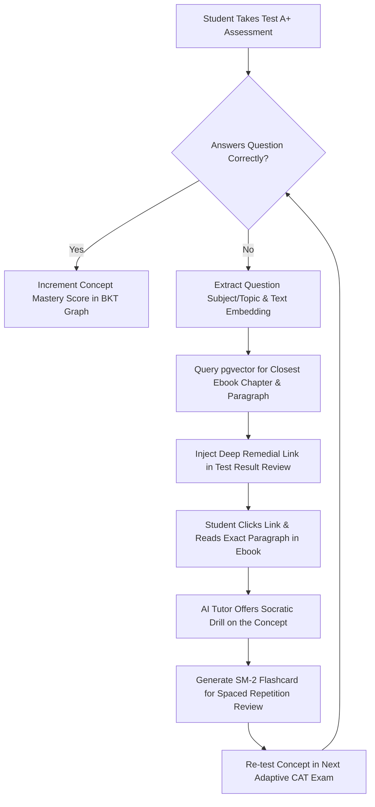

# AI TUTOR & DEEP TEST-EBOOK BRIDGE SPECIFICATION

> **System Modules:** `apps.ai_tutor`, `apps.ebooks`, `apps.tests_engine`  
> **Status:** CANONICAL PRODUCTION SPECIFICATION  
> **Engineering Level:** Principal AI Research Scientist & Learning Systems Engineer  
> **Target Release:** LearningHub V8.0 (September 2026)  
> **Core Algorithms:** SuperMemo-2 (SM-2) + pgvector Semantic Alignment + Socratic Prompting  

---

## 1. ARCHITECTURAL VISION: THE CLOSED-LOOP LEARNING FLYWHEEL

LearningHub bridges the gap between **passive reading** (ebooks) and **active evaluation** (tests) through an automated, closed-loop AI remediation flywheel:



---

## 2. DEEP TEST-EBOOK REMEDIATION BRIDGE

### 2.1 Concept Semantic Alignment via `pgvector`
When a student answers incorrectly in `TestAttempt`, the system triggers an asynchronous remediation task:
1. The question's dense vector embedding $\vec{v}_Q \in \mathbb{R}^{1536}$ is retrieved.
2. A cosine distance query is executed against chapter paragraph chunk embeddings $\vec{v}_C$:
   ```sql
   SELECT 
       chapter.id AS chapter_id,
       chapter.title AS chapter_title,
       chunk.paragraph_index,
       chunk.content_snippet,
       1 - (chunk.embedding <=> :question_vector) AS cosine_similarity
   FROM ebooks_chapterchunk chunk
   JOIN ebooks_ebookchapter chapter ON chunk.chapter_id = chapter.id
   WHERE chapter.ebook_id = :curriculum_ebook_id
   ORDER BY chunk.embedding <=> :question_vector ASC
   LIMIT 1;
   ```
3. If `cosine_similarity >= 0.78`, the diagnostic report presents a direct deep-link:
   > *"You missed Question #14 on Dynamic Viscosity. Read Chapter 4, Section 4.2 in Fluid Mechanics (Paragraph 7) to review this concept."*
4. Clicking the link opens `EbookReaderPage` directly at the highlighted paragraph anchor.

---

## 3. CONTEXTUAL INLINE AI TUTOR (`AITutorPage` & Reader Sidebar)

The AI Tutor acts as a personal 1-on-1 Socratic instructor directly integrated into the reader interface.

### 3.1 Cognitive Level Modes
Students can toggle between 4 distinct explanation personas:
1. **Analogy Mode (ELI5):** Explains concepts using relatable real-world physical analogies without heavy jargon.
2. **Standard Undergraduate:** Rigorous technical explanations with step-by-step mathematical reasoning and KaTeX formulas.
3. **Graduate / Research:** Deep dive into boundary conditions, edge cases, algorithmic complexity, and academic literature.
4. **Socratic Mode:** The AI refuses to give direct answers; instead, it asks progressive guiding questions to help the student derive the answer themselves.

### 3.2 Multilingual & Code-Switching Support
The AI Tutor natively supports:
- **English:** Formal technical prose.
- **Hindi (Devanagari):** Technical terms preserved in Latin script while explanations are rendered in fluent Hindi.
- **Hinglish:** Natural conversational bilingual dialogue tailored to Indian engineering students.
- **Spanish & French:** Fully localized STEM curriculum support.

---

## 4. SUPERMEMO-2 (SM-2) SPACED REPETITION ENGINE

To prevent forgetting, concepts flagged from incorrect test answers or highlighted ebook passages are scheduled for spaced review via the SuperMemo-2 algorithm.

### 4.1 SM-2 Mathematical Formulation
Each flashcard tracks four state variables:
- $n$: Repetition number (number of consecutive successful reviews).
- $EF$: Ease Factor (reflects inherent difficulty, initialized to $2.5$).
- $I_n$: Interval in days until the next scheduled review.
- $q$: Student review quality score ($0 \le q \le 5$):
  - $5$: Perfect response with zero hesitation.
  - $4$: Correct response with minor pause.
  - $3$: Correct response with significant effort.
  - $2$: Incorrect response, but remembered upon seeing answer.
  - $1$: Incorrect response, looked familiar.
  - $0$: Complete blackout.

### 4.2 State Update Equations
When a user reviews a card and submits quality $q$:
1. **Calculate New Ease Factor ($EF'$):**
   $$EF' = \max\left(1.3, EF + (0.1 - (5 - q) \times (0.08 + (5 - q) \times 0.02))\right)$$
2. **Calculate Next Interval ($I_n$):**
   $$I_n = \begin{cases} 
   1 & \text{if } n = 1 \\
   6 & \text{if } n = 2 \\
   \lceil I_{n-1} \times EF' \rceil & \text{if } n > 2 \text{ and } q \ge 3 \\
   1 & \text{if } q < 3 \quad (\text{reset streak})
   \end{cases}$$
3. **Calculate Next Review Timestamp:**
   $$\text{next\_review\_date} = \text{current\_date} + I_n \text{ days}$$

---

## 5. AUTOMATED FLASHCARD & MINI-QUIZ GENERATION

When a student highlights a difficult concept or completes a chapter:
1. **Active Recall Prompt Generation:** The AI extracts the core factual or relational assertion and generates a front/back active recall flashcard.
2. **Distractor Generation:** Generates 3 plausible distractors for instant 10-second rapid-fire review quizzes.
3. **Review Queue Dispatch:** Cards due on the current calendar day appear in the student's daily review queue at `/ai-tutor` with a streak counter to incentivize habit formation.
