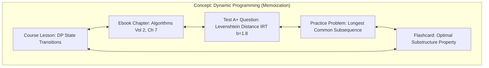

# CROSS-SUBSYSTEM ANALYTICS & KNOWLEDGE GRAPH ENGINE SPECIFICATION

> **System Component:** `apps.core.analytics` & `AnalyticsPage`  
> **Status:** CANONICAL PRODUCTION SPECIFICATION  
> **Engineering Level:** Principal AI Architect & Data Systems Engineer  
> **Target Release:** LearningHub V8.0 (September 2026)  
> **Core Models:** Bayesian Knowledge Tracing (BKT) + Unified Multi-Modal Knowledge Graph  

---

## 1. THE UNIFIED LEARNING KNOWLEDGE GRAPH

LearningHub unifies four distinct educational modalities into a single conceptual knowledge graph:

Every interaction across courses, ebooks, tests, and code execution maps back to a canonical `ConceptNode` UUID.

---

## 2. BAYESIAN KNOWLEDGE TRACING (BKT) MODEL

To determine whether a student has truly mastered a concept, the engine implements Bayesian Knowledge Tracing (BKT).

### 2.1 Standard BKT Parameters
For each concept node $k$:
- $P(L_0)$: Prior probability of knowing the concept before practice ($0.10 - 0.20$).
- $P(T)$: Transition probability of learning the concept after a practice opportunity ($0.15 - 0.25$).
- $P(G)$: Guess probability (correct answer despite not knowing concept, $0.10 - 0.25$).
- $P(S)$: Slip probability (incorrect answer despite knowing concept, $0.05 - 0.10$).

### 2.2 Bayesian Update Equations
Upon receiving a student response at interaction step $t$:

**Case 1: Student answers correctly ($O_t = 1$):**
$$P(L_t | O_t = 1) = \frac{P(L_{t-1}) \cdot (1 - P(S))}{P(L_{t-1}) \cdot (1 - P(S)) + (1 - P(L_{t-1})) \cdot P(G)}$$

**Case 2: Student answers incorrectly ($O_t = 0$):**
$$P(L_t | O_t = 0) = \frac{P(L_{t-1}) \cdot P(S)}{P(L_{t-1}) \cdot P(S) + (1 - P(L_{t-1})) \cdot (1 - P(G))}$$

**Step 2: Account for learning transition between steps:**
$$P(L_{t+1}) = P(L_t | O_t) + (1 - P(L_t | O_t)) \cdot P(T)$$

When $P(L_t) \ge 0.85$, the student is officially marked as having **Mastered** the concept.

---

## 3. PREDICTIVE EXAM READINESS SCORE ($0 - 100\%$)

The engine forecasts student performance on competitive examinations using a 4-factor composite readiness model:

$$R_{\text{exam}} = 0.35 \cdot M_{\text{syllabus}} + 0.30 \cdot S_{\text{mock}} + 0.20 \cdot A_{\text{speed}} + 0.15 \cdot R_{\text{retention}}$$

### 3.1 Composite Components
1. **Syllabus Mastery ($M_{\text{syllabus}}$):** Weighted average of BKT concept probabilities across all exam topics.
2. **Standardized Mock Score ($S_{\text{mock}}$):** Percentile score across recent 3 timed national-level mock tests.
3. **Speed & Time Management Index ($A_{\text{speed}}$):** Ratio of questions attempted within target time without accuracy collapse.
4. **Spaced Retention Metric ($R_{\text{retention}}$):** Percentage of due flashcard reviews maintained with quality $q \ge 3$.

---

## 4. MULTI-DIMENSIONAL LEARNING RADAR

The student profile and analytics dashboard (`/analytics`) visually displays a 6-axis capability radar:

1. **Conceptual Foundations:** Grasp of theoretical principles and definitions.
2. **Analytical Problem Solving:** Accuracy on complex, multi-step calculation questions.
3. **Speed & Timing:** Latency per question compared to national top 10% benchmark.
4. **Code Implementation:** Pass rate on DSA edge cases and runtime complexity benchmarks.
5. **Retention & Recall:** Active recall consistency over 7-, 30-, and 90-day intervals.
6. **Persistence & Discipline:** Daily study streaks and proactive completion rate.
