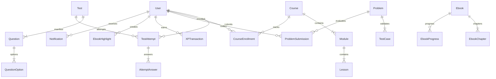

# LEARNINGHUB — BACKEND TRUTH ENGINE (V5.0 GROUND TRUTH)

> **Document Version:** 5.0.0-PROD-TRUTH  
> **Status:** VERIFIED GROUND TRUTH  
> **Platform:** LearningHub Unified Backend (Django 5.0 + DRF + PostgreSQL 16 + Redis 7 + Celery 5.4 + Daphne ASGI)  
> **Target Date:** September 2026  
> **Frontend Consumer:** React 18 / TypeScript 5 Vite SPA (`learninghub/src/`) & Native Flutter Client (`windows_app/`)  

---

## 1. RUNTIME CONFIGURATION & ENVIRONMENT

### 1.1 Active Backend Stack
- **Framework:** Python 3.13 / Django 5.0.2 / Django REST Framework 3.15
- **Web & ASGI Server:** Daphne 4.1.2 (HTTP/1.1, HTTP/2, WebSockets) on `0.0.0.0:8000`
- **Asynchronous Task Queue:** Celery 5.4.0 (Worker concurrency 4, prefork, prefetch multiplier 1)
- **Database:** PostgreSQL 16 with `pgvector` extension enabled for semantic similarity embeddings
- **In-Memory Cache & Message Broker:** Redis 7.2 (Connection pool max 100, password-authenticated)
- **Production Static & Media Storage:** WhiteNoise for static assets, local persistent volume (`/app/media/`) or S3-compatible object storage for uploads, PDFs, and certificates.

### 1.2 Settings Split Architecture (`config/settings/`)
The runtime is organized into a 12-factor modular hierarchy:
1. **`base.py`**:
   - Central definition for `INSTALLED_APPS`, middleware pipeline, REST framework defaults, SimpleJWT parameters, and Celery beat schedules.
   - Fail-secure defaults (`DEBUG = False`, `CORS_ALLOW_ALL_ORIGINS = False`).
2. **`development.py`**:
   - `DEBUG = True`
   - `CORS_ALLOW_ALL_ORIGINS = True`
   - In-memory caching fallback (`LocMemCache`) and eager task execution (`CELERY_TASK_ALWAYS_EAGER = True`).
3. **`production.py`**:
   - Strict SSL enforcement: `SECURE_SSL_REDIRECT = True`, `SECURE_HSTS_SECONDS = 31536000`, `SECURE_HSTS_PRELOAD = True`.
   - Cookie flags: `SESSION_COOKIE_SECURE = True`, `CSRF_COOKIE_SECURE = True`, `SESSION_COOKIE_HTTPONLY = True`.
   - PostgreSQL connection pooling: `CONN_MAX_AGE = 600`, `conn_health_checks = True`.
4. **`test.py`**:
   - In-memory SQLite database (`:memory:`) with `DisableMigrations` for sub-second test execution.
   - Fast password hashing (`MD5PasswordHasher`) to accelerate authentication unit tests.

### 1.3 Installed Applications (The 12 Canonical Apps)
```python
INSTALLED_APPS = [
    # Core Django
    'daphne',
    'django.contrib.admin',
    'django.contrib.auth',
    'django.contrib.contenttypes',
    'django.contrib.sessions',
    'django.contrib.messages',
    'django.contrib.staticfiles',
    'django.contrib.postgres',
    # Third-Party Infrastructure
    'rest_framework',
    'rest_framework_simplejwt',
    'rest_framework_simplejwt.token_blacklist',
    'corsheaders',
    'django_filters',
    'drf_spectacular',
    'channels',
    'django_prometheus',
    'axes',
    # 12 Canonical Domain Apps
    'apps.core',
    'apps.users',
    'apps.courses',
    'apps.test_engine',
    'apps.dsa',
    'apps.analytics',
    'apps.ai_engine',
    'apps.ebooks',
    'apps.gamification',
    'apps.notifications',
    'apps.payments',
    'apps.search',
]
```

### 1.4 Active Middleware Order
1. `django_prometheus.middleware.PrometheusBeforeMiddleware` (Metrics start)
2. `corsheaders.middleware.CorsMiddleware` (CORS headers before auth)
3. `django.middleware.security.SecurityMiddleware` (SSL & headers)
4. `whitenoise.middleware.WhiteNoiseMiddleware` (Static asset caching)
5. `apps.core.security_middleware.SecurityHeadersMiddleware` (HSTS, CSP, X-Frame-Options)
6. `apps.core.middleware.InputSanitizationMiddleware` (Strip XSS vectors)
7. `apps.core.middleware.CORSHardeningMiddleware` (Header filtering)
8. `django.contrib.sessions.middleware.SessionMiddleware`
9. `django.middleware.common.CommonMiddleware`
10. `apps.core.middleware.CSRFHeaderNormalizerMiddleware` (Normalizes `X-CSRF-Token` & `X-CSRFToken`)
11. `django.middleware.csrf.CsrfViewMiddleware`
12. `django.contrib.auth.middleware.AuthenticationMiddleware`
13. `apps.core.security_middleware.JWTBlacklistMiddleware`
14. `apps.core.audit_middleware.AuditMiddleware` (Audit logging actor, IP, path)
15. `django.contrib.messages.middleware.MessageMiddleware`
16. `django.middleware.clickjacking.XFrameOptionsMiddleware`
17. `csp.middleware.CSPMiddleware`
18. `django_prometheus.middleware.PrometheusAfterMiddleware` (Metrics finalization)
19. `axes.middleware.AxesMiddleware` (Brute-force lockout monitoring)

---

## 2. API INVENTORY ACROSS ALL 12 APPS

Every endpoint is mapped to its HTTP Method, URI Path, Authentication, Serializer, Service Layer, Permissions, and Rate Limits:

### 2.1 Authentication & Users (`apps.users`)
| Method | Path | Auth | Serializer | Service Function | Permissions | Rate Limit |
|:---|:---|:---|:---|:---|:---|:---|
| `POST` | `/api/v1/auth/register` | None | `RegisterSerializer` | `UserService.register_user()` | `AllowAny` | `10/hour` |
| `POST` | `/api/v1/auth/login` | None | `LoginSerializer` | `UserService.authenticate_user()` | `AllowAny` | `5/min` |
| `POST` | `/api/v1/auth/refresh` | None (Refresh) | `RefreshTokenSerializer` | `UserService.rotate_tokens()` | `AllowAny` | `30/min` |
| `POST` | `/api/v1/auth/logout` | JWT Access | `LogoutSerializer` | `UserService.blacklist_token()` | `IsAuthenticated` | `60/min` |
| `POST` | `/api/v1/auth/logout-all` | JWT Access | - | `UserService.blacklist_all_sessions()` | `IsAuthenticated` | `5/min` |
| `POST` | `/api/v1/auth/mfa/setup` | JWT Access | `MfaSetupSerializer` | `TwoFactorService.setup_totp()` | `IsAuthenticated` | `10/hour` |
| `POST` | `/api/v1/auth/mfa/verify` | JWT Access | `MfaVerifySerializer` | `TwoFactorService.verify_totp()` | `IsAuthenticated` | `10/min` |
| `POST` | `/api/v1/auth/forgot-password` | None | `PasswordResetRequestSerializer` | `UserService.send_password_reset()` | `AllowAny` | `3/hour` |
| `POST` | `/api/v1/auth/reset-password` | None | `PasswordResetConfirmSerializer` | `UserService.confirm_password_reset()`| `AllowAny` | `5/hour` |
| `GET` | `/api/v1/users/me` | JWT Access | `UserDetailSerializer` | `UserSelector.get_user_profile()` | `IsAuthenticated` | `1000/day` |
| `PUT` | `/api/v1/users/profile` | JWT Access | `UserProfileUpdateSerializer` | `UserService.update_profile()` | `IsAuthenticated` | `60/min` |
| `POST` | `/api/v1/users/avatar` | JWT Access | `AvatarUploadSerializer` | `UserService.update_avatar()` | `IsAuthenticated` | `20/hour` |
| `GET` | `/api/v1/users/streak` | JWT Access | `UserStreakSerializer` | `UserSelector.get_streak_status()` | `IsAuthenticated` | `1000/day` |
| `GET` | `/api/v1/users/sessions` | JWT Access | `UserSessionSerializer` | `SessionSelector.list_active_sessions()`| `IsAuthenticated`| `60/min` |

### 2.2 Courses LMS (`apps.courses`)
| Method | Path | Auth | Serializer | Service Function | Permissions | Rate Limit |
|:---|:---|:---|:---|:---|:---|:---|
| `GET` | `/api/v1/courses` | Optional | `CourseListSerializer` | `CourseSelector.list_published_courses()` | `AllowAny` | `1000/day` |
| `GET` | `/api/v1/courses/<id>` | Optional | `CourseDetailSerializer` | `CourseSelector.get_course_by_slug_or_id()`| `AllowAny` | `1000/day` |
| `POST` | `/api/v1/courses/<id>/enroll` | JWT Access | `EnrollmentSerializer` | `CourseService.enroll_user()` | `IsAuthenticated` | `30/min` |
| `GET` | `/api/v1/lessons/<id>` | JWT Access | `LessonDetailSerializer` | `CourseSelector.get_lesson_player_data()` | `IsEnrolledInCourse` | `1000/day` |
| `POST` | `/api/v1/lessons/<id>/progress` | JWT Access | `LessonProgressSerializer`| `CourseService.record_progress()` | `IsEnrolledInCourse` | `120/min` |
| `GET` | `/api/v1/certificates/<course_id>`| JWT Access | `CertificateSerializer` | `CertificateSelector.get_or_create()` | `IsCourseCompleted` | `60/min` |
| `GET` | `/api/v1/learning-paths` | Optional | `LearningPathSerializer` | `CourseSelector.list_learning_paths()` | `AllowAny` | `1000/day` |
| `GET` | `/api/v1/courses/<id>/reviews` | Optional | `ReviewSerializer` | `CourseSelector.list_course_reviews()` | `AllowAny` | `500/day` |
| `POST` | `/api/v1/courses/<id>/reviews` | JWT Access | `ReviewCreateSerializer` | `CourseService.submit_review()` | `IsEnrolledInCourse` | `10/day` |

### 2.3 Test A+ Engine (`apps.test_engine`)
| Method | Path | Auth | Serializer | Service Function | Permissions | Rate Limit |
|:---|:---|:---|:---|:---|:---|:---|
| `GET` | `/api/v1/tests` | Optional | `TestListSerializer` | `TestSelector.list_active_tests()` | `AllowAny` | `1000/day` |
| `GET` | `/api/v1/tests/<id>` | Optional | `TestDetailSerializer` | `TestSelector.get_test_details()` | `AllowAny` | `1000/day` |
| `POST` | `/api/v1/tests/<id>/start` | JWT Access | `TestSessionSerializer` | `TestEngineService.start_attempt()` | `IsAuthenticated` | `20/min` |
| `POST` | `/api/v1/tests/<id>/autosave` | JWT Access | `AutosaveAnswerSerializer`| `TestEngineService.save_answers_atomic()`| `IsAttemptOwner` | `120/min` |
| `POST` | `/api/v1/tests/<id>/submit` | JWT Access | `TestSubmissionSerializer`| `TestEngineService.submit_and_grade()` | `IsAttemptOwner` | `10/min` |
| `GET` | `/api/v1/tests/<id>/result` | JWT Access | `TestResultSerializer` | `TestSelector.get_attempt_evaluation()`| `IsAttemptOwner` | `1000/day` |
| `GET` | `/api/v1/tests/attempts` | JWT Access | `AttemptHistorySerializer`| `TestSelector.list_user_attempts()` | `IsAuthenticated` | `1000/day` |
| `GET` | `/api/v1/tests/analytics/topics`| JWT Access | `TopicProficiencySerializer`| `TestSelector.get_topic_analytics()`| `IsAuthenticated` | `1000/day` |
| `POST` | `/api/v1/tests/<id>/bookmark` | JWT Access | `BookmarkSerializer` | `TestService.toggle_question_bookmark()`| `IsAuthenticated`| `60/min` |

### 2.4 DSA Platform (`apps.dsa`)
| Method | Path | Auth | Serializer | Service Function | Permissions | Rate Limit |
|:---|:---|:---|:---|:---|:---|:---|
| `GET` | `/api/v1/problems` | Optional | `ProblemListSerializer` | `DSASelector.list_problems()` | `AllowAny` | `1000/day` |
| `GET` | `/api/v1/problems/<slug_id>` | Optional | `ProblemDetailSerializer` | `DSASelector.get_problem_detail()` | `AllowAny` | `1000/day` |
| `POST` | `/api/v1/problems/<slug_id>/run` | JWT Access | `CodeRunRequestSerializer` | `CodeExecutionService.run_sample()` | `IsAuthenticated` | `30/min` |
| `POST` | `/api/v1/problems/<slug_id>/submit`| JWT Access| `SubmissionSerializer` | `CodeExecutionService.submit_solution()`| `IsAuthenticated`| `10/min` |
| `GET` | `/api/v1/problems/<slug_id>/submissions`| JWT Access| `SubmissionHistorySerializer`| `DSASelector.get_submissions()`| `IsAuthenticated`| `1000/day` |
| `POST` | `/api/v1/code/run` | JWT Access | `CustomCodeRunSerializer` | `CodeExecutionService.run_playground()` | `IsAuthenticated` | `20/min` |
| `GET` | `/api/v1/problems/<slug_id>/hint` | JWT Access | `HintSerializer` | `DSAService.get_tiered_hint()` | `IsAuthenticated` | `60/min` |

### 2.5 Analytics Engine (`apps.analytics`)
| Method | Path | Auth | Serializer | Service Function | Permissions | Rate Limit |
|:---|:---|:---|:---|:---|:---|:---|
| `GET` | `/api/v1/analytics/dashboard` | JWT Access | `DashboardStatsSerializer` | `AnalyticsSelector.get_user_dashboard()`| `IsAuthenticated`| `1000/day` |
| `GET` | `/api/v1/analytics/activity` | JWT Access | `LearningActivitySerializer`| `AnalyticsSelector.get_activity_log()` | `IsAuthenticated` | `1000/day` |
| `GET` | `/api/v1/analytics/topics` | JWT Access | `TopicPerformanceSerializer`| `AnalyticsSelector.get_weak_topics()` | `IsAuthenticated` | `1000/day` |
| `GET` | `/api/v1/analytics/recommendations`| JWT Access| `RecommendationSerializer`| `AnalyticsService.compute_recommendations()`| `IsAuthenticated`| `60/min` |
| `POST` | `/api/v1/analytics/export` | JWT Access | `ReportExportSerializer` | `AnalyticsService.generate_report_pdf()` | `IsAuthenticated` | `5/hour` |

### 2.6 AI Tutor Engine (`apps.ai_engine`)
| Method | Path | Auth | Serializer | Service Function | Permissions | Rate Limit |
|:---|:---|:---|:---|:---|:---|:---|
| `POST` | `/api/v1/ai/tutor/chat` | JWT Access | `AIChatRequestSerializer` | `AIEngineService.chat_tutor()` | `IsAuthenticated` | `15/min` |
| `POST` | `/api/v1/ai/explain` | JWT Access | `AIExplainRequestSerializer` | `AIEngineService.explain_concept()` | `IsAuthenticated` | `20/min` |
| `POST` | `/api/v1/ai/debug` | JWT Access | `AIDebugRequestSerializer` | `AIEngineService.debug_code_review()` | `IsAuthenticated` | `15/min` |
| `POST` | `/api/v1/ai/study-plan` | JWT Access | `AIStudyPlanRequestSerializer` | `AIEngineService.generate_study_plan()`| `IsAuthenticated`| `5/day` |
| `POST` | `/api/v1/ai/ebook/summarize-chapter`| JWT Access| `ChapterSummarySerializer` | `AIEngineService.summarize_chapter()` | `IsAuthenticated` | `20/min` |
| `GET` | `/api/v1/ai/stream` (SSE) | JWT Access | - | `AIEngineService.stream_response()` | `IsAuthenticated` | `15/min` |

### 2.7 Ebook System (`apps.ebooks`)
| Method | Path | Auth | Serializer | Service Function | Permissions | Rate Limit |
|:---|:---|:---|:---|:---|:---|:---|
| `GET` | `/api/v1/ebooks` | Optional | `EbookListSerializer` | `EbookSelector.list_ebooks()` | `AllowAny` | `1000/day` |
| `GET` | `/api/v1/ebooks/<slug_id>` | Optional | `EbookDetailSerializer` | `EbookSelector.get_ebook_detail()` | `AllowAny` | `1000/day` |
| `GET` | `/api/v1/ebooks/<id>/chapters/<order>`| JWT Access| `ChapterContentSerializer` | `EbookSelector.get_chapter_content()` | `IsAuthenticated` | `1000/day` |
| `POST` | `/api/v1/ebooks/<id>/progress` | JWT Access | `EbookProgressSerializer` | `EbookService.save_reading_progress()` | `IsAuthenticated` | `120/min` |
| `GET` | `/api/v1/ebooks/<id>/highlights` | JWT Access | `HighlightSerializer` | `EbookSelector.list_highlights()` | `IsAuthenticated` | `500/day` |
| `POST` | `/api/v1/ebooks/<id>/highlights` | JWT Access | `HighlightCreateSerializer` | `EbookService.create_highlight()` | `IsAuthenticated` | `60/min` |
| `DELETE`| `/api/v1/ebooks/highlights/<id>` | JWT Access | - | `EbookService.delete_highlight()` | `IsOwner` | `60/min` |
| `GET` | `/api/v1/ebooks/<id>/flashcards` | JWT Access | `FlashcardSerializer` | `EbookSelector.list_flashcards()` | `IsAuthenticated` | `500/day` |

### 2.8 Gamification (`apps.gamification`)
| Method | Path | Auth | Serializer | Service Function | Permissions | Rate Limit |
|:---|:---|:---|:---|:---|:---|:---|
| `GET` | `/api/v1/gamification/status` | JWT Access | `GamificationStatusSerializer`| `GamificationSelector.get_status()` | `IsAuthenticated` | `1000/day` |
| `GET` | `/api/v1/gamification/badges` | JWT Access | `BadgeSerializer` | `GamificationSelector.list_badges()` | `IsAuthenticated` | `1000/day` |
| `GET` | `/api/v1/gamification/leaderboard`| Optional | `LeaderboardSerializer` | `LeaderboardService.get_rankings()` | `AllowAny` | `60/min` |
| `GET` | `/api/v1/gamification/daily-goals`| JWT Access | `DailyGoalSerializer` | `GamificationSelector.get_goals()` | `IsAuthenticated` | `1000/day` |
| `POST` | `/api/v1/badges/check` | JWT Access | `BadgeCheckSerializer` | `GamificationService.evaluate_rules()` | `IsAuthenticated` | `60/min` |

### 2.9 Notifications (`apps.notifications`)
| Method | Path | Auth | Serializer | Service Function | Permissions | Rate Limit |
|:---|:---|:---|:---|:---|:---|:---|
| `GET` | `/api/v1/notifications` | JWT Access | `NotificationSerializer` | `NotificationSelector.list_inbox()` | `IsAuthenticated` | `60/min` |
| `PUT` | `/api/v1/notifications/<id>/read` | JWT Access | `NotificationReadSerializer` | `NotificationService.mark_read()` | `IsOwner` | `60/min` |
| `PUT` | `/api/v1/notifications/read-all` | JWT Access | - | `NotificationService.mark_all_read()` | `IsAuthenticated` | `20/min` |
| `GET` | `/api/v1/notifications/unread-count`| JWT Access| `UnreadCountSerializer` | `NotificationSelector.unread_count()` | `IsAuthenticated` | `60/min` |

### 2.10 Payments & Cart (`apps.payments`)
| Method | Path | Auth | Serializer | Service Function | Permissions | Rate Limit |
|:---|:---|:---|:---|:---|:---|:---|
| `GET` | `/api/v1/cart` | JWT Access | `CartSerializer` | `PaymentSelector.get_user_cart()` | `IsAuthenticated` | `120/min` |
| `POST` | `/api/v1/cart/items` | JWT Access | `CartItemCreateSerializer` | `PaymentService.add_item_to_cart()` | `IsAuthenticated` | `60/min` |
| `DELETE`| `/api/v1/cart/items/<id>` | JWT Access | - | `PaymentService.remove_item()` | `IsOwner` | `60/min` |
| `POST` | `/api/v1/checkout/create-session` | JWT Access | `CheckoutSessionSerializer`| `PaymentService.create_stripe_session()`| `IsAuthenticated`| `10/hour` |
| `POST` | `/api/v1/payments/webhook` | None (Signature) | `WebhookSerializer` | `PaymentService.handle_webhook()` | `AllowAny` | Unlimited |
| `GET` | `/api/v1/subscriptions/current` | JWT Access | `SubscriptionSerializer` | `PaymentSelector.get_subscription()` | `IsAuthenticated` | `120/min` |

### 2.11 Global Search (`apps.search`)
| Method | Path | Auth | Serializer | Service Function | Permissions | Rate Limit |
|:---|:---|:---|:---|:---|:---|:---|
| `GET` | `/api/v1/search` | Optional | `SearchResultsSerializer` | `SearchSelector.global_search()` | `AllowAny` | `120/min` |
| `GET` | `/api/v1/search/autocomplete` | Optional | `AutocompleteSerializer` | `SearchService.get_suggestions()` | `AllowAny` | `240/min` |
| `GET` | `/api/v1/search/trending` | Optional | `TrendingSearchSerializer`| `SearchSelector.get_trending_tags()` | `AllowAny` | `120/min` |

### 2.12 Platform Core & Admin (`apps.core`)
| Method | Path | Auth | Serializer | Service Function | Permissions | Rate Limit |
|:---|:---|:---|:---|:---|:---|:---|
| `GET` | `/health/` | None | `HealthCheckSerializer` | `HealthService.check_components()` | `AllowAny` | `60/min` |
| `GET` | `/health/live/` | None | - | `HealthService.liveness_probe()` | `AllowAny` | `120/min` |
| `GET` | `/health/ready/` | None | - | `HealthService.readiness_probe()` | `AllowAny` | `120/min` |
| `GET` | `/health/deep/` | Admin JWT | `DeepHealthSerializer` | `HealthService.deep_system_check()` | `IsAdminRole` | `10/min` |
| `GET` | `/api/v1/admin/users` | Admin JWT | `AdminUserListSerializer` | `AdminSelector.list_users()` | `IsAdminRole` | `500/day` |
| `GET` | `/api/v1/admin/analytics` | Admin JWT | `AdminPlatformStatsSerializer`| `AdminSelector.get_platform_stats()` | `IsAdminRole` | `500/day` |
| `POST` | `/api/v1/admin/questions/moderate`| Admin JWT| `QuestionModerationSerializer`| `AdminService.moderate_question()` | `IsAdminRole` | `100/min` |

---

## 3. DATABASE GROUND TRUTH (PostgreSQL 16)

### 3.1 Primary Database Models Mapping


### 3.2 Key Indexes, Constraints & Storage
- **PostgreSQL Vector Embeddings**: `courses.course.embedding` & `ai_engine.document.embedding` indexed via `HnswIndex(m=16, ef_construction=64, vector_cosine_ops)` for millisecond semantic vector retrieval.
- **Full-Text Search Indexes**: PostgreSQL `GinIndex` across `courses.title, courses.description`, `problems.title, problems.description`, and `questions.prompt`.
- **Database Constraints**:
  - Unique composite index on `apps.test_engine.AttemptAnswer(attempt_id, question_id)` preventing duplicate answer saves during concurrent autosaves.
  - Unique composite index on `apps.courses.CourseEnrollment(user_id, course_id)` preventing duplicate billing/enrollment.
  - Foreign key cascading: `on_delete=models.CASCADE` on child entities (Options, Answers, Modules), `on_delete=models.PROTECT` on billing/financial transaction ledgers (`XPTransaction`, `PaymentTransaction`).

---

## 4. CELERY ASYNCHRONOUS ENGINE

### 4.1 Broker & Queue Architecture
- **Broker:** Redis 7 database 0 (`redis://:${REDIS_PASSWORD}@redis:6379/0`)
- **Result Backend:** Redis 7 database 1 (`redis://:${REDIS_PASSWORD}@redis:6379/1`)
- **Queue Definitions:**
  1. `default`: Low-latency transaction operations (email alerts, notification delivery, certificate generation, XP awarding).
  2. `ai_queue`: Segregated high-resource worker queue for LLM batch processing, embedding calculations, and test generation.
  3. `dsa_sandbox`: Isolated queue for untrusted code execution sandbox with CPU timeouts.

### 4.2 Celery Beat Schedules
| Task Name | Interval / Cron | Target Function |
|:---|:---|:---|
| `test_engine.check_expired_attempts` | Every 60 seconds | `apps.test_engine.tasks.check_expired_attempts()` |
| `test_engine.cleanup_abandoned` | Every 24 hours | `apps.test_engine.tasks.cleanup_abandoned_attempts()` |
| `test_engine.recalibrate_irt_stats` | Daily at 02:00 UTC | `apps.test_engine.tasks.recalculate_question_stats()` |
| `gamification.reset_weekly_xp` | Weekly (Sunday midnight) | `apps.gamification.tasks.reset_weekly_leaderboards()` |
| `gamification.streak_reminders` | Daily at 18:00 UTC | `apps.gamification.tasks.process_streak_reminders()` |
| `analytics.daily_aggregation` | Daily at 00:05 UTC | `apps.analytics.tasks.aggregate_daily_analytics()` |
| `core.prune_audit_logs` | Monthly | `apps.core.tasks.cleanup_old_audit_logs()` |

---

## 5. REDIS CACHING SCHEME

All keys use prefix `learninghub:v5:`:
- **Session & Token Caching**: `learninghub:v5:token_blacklist:<jti>` (TTL = Refresh token lifespan).
- **Leaderboards (Sorted Sets)**:
  - Global: `learninghub:v5:leaderboard:global` (Score: total XP, Value: `user_id`)
  - Weekly: `learninghub:v5:leaderboard:weekly:<YYYY_WW>`
- **Catalog Warm Caches**:
  - `learninghub:v5:courses:catalog` (TTL: 3600s, invalidated on Course write)
  - `learninghub:v5:tests:catalog` (TTL: 1800s, invalidated on Test write)
  - `learninghub:v5:problems:catalog` (TTL: 3600s)
- **Rate-Limiting Counters**: `learninghub:v5:ratelimit:<scope>:<ip_or_user>` (Sliding window via Redis pipelined ZREMRANGEBYSCORE).

---

## 6. STORAGE & STATIC ASSET INVENTORY

- **Static Root**: `staticfiles/` collected via `manage.py collectstatic --noinput` and served directly with gzip/brotli compression by WhiteNoise.
- **Media Root**: `media/`
  - `media/avatars/`: User profile images (max 5MB, JPEG/PNG/WebP, magic bytes verified).
  - `media/certificates/`: Generated PDF cryptographic course certificates.
  - `media/ebooks/`: Uploaded ePub/PDF files with strict extension and MIME verification.
  - `media/course_assets/`: Course covers and downloadable syllabus attachments.
