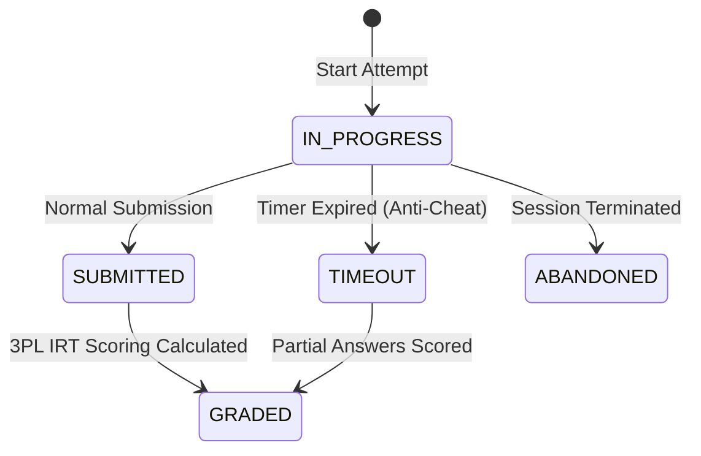

# LearningHub V15 — Business Logic & Domain Flow Audit (Phase 4)

**Generated:** 2026-09-28  
**Domain Areas:** Authentication & RBAC, Course Enrollment, Exam Attempt State Machine, E-commerce, Gamification & Spaced Repetition.

---

## 1. Authentication, Sessions & RBAC

- **JWT Token Flow**:
  - Access Token Lifetime: 60 minutes (`apps/core/authentication.py`, SimpleJWT).
  - Refresh Token Lifetime: 7 days with rotation and server-side token blacklisting.
  - Refresh Mutex: Frontend `refreshAccessToken()` ensures multiple simultaneous 401s share a single refresh request.
- **Role-Based Access Control**:
  - Hierarchy: `Student` < `Instructor` < `Moderator` < `Admin` < `Superadmin`.
  - Admin endpoints strictly enforce `IsAdminUser` / `hasRole(['admin', 'superadmin'])`.

---

## 2. Course Enrollment & Content Gating

- **Access Guard**:
  - Free courses (`course.price == 0`) are accessible to all registered users upon one-click enrollment.
  - Paid courses require confirmed order / subscription via Stripe webhook before granting `Enrollment`.
  - Lessons marked `is_free_preview=True` allow video playback without enrollment; all other lesson media URLs are hidden until enrolled.
- **Progress Tracking**:
  - Progress percentage automatically recalculated on lesson completion: `round((completed_lessons / total_lessons) * 100, 1)`.

---

## 3. Exam Attempt State Machine

- **Anti-Cheat Timer Enforcement**:
  - Server verifies `now - attempt.started_at <= test.duration_minutes + grace_period`.
  - If exceeded, status transitions directly to `TIMEOUT`, scoring only saved answers.
  - Subsequent submissions for a terminated attempt are rejected with HTTP 400.

---

## 4. Spaced Repetition (SuperMemo SM-2)

- **Formula**:
  - If quality $\ge 3$: $EF' = EF + (0.1 - (5 - q) \cdot (0.08 + (5 - q) \cdot 0.02))$, with $EF \ge 1.3$.
  - Interval progression: Day 1 $\to$ Day 6 $\to$ $I_{prev} \times EF$.
  - If quality $< 3$: Repetitions reset to 0, interval resets to 1 day, lapse counter increments.
