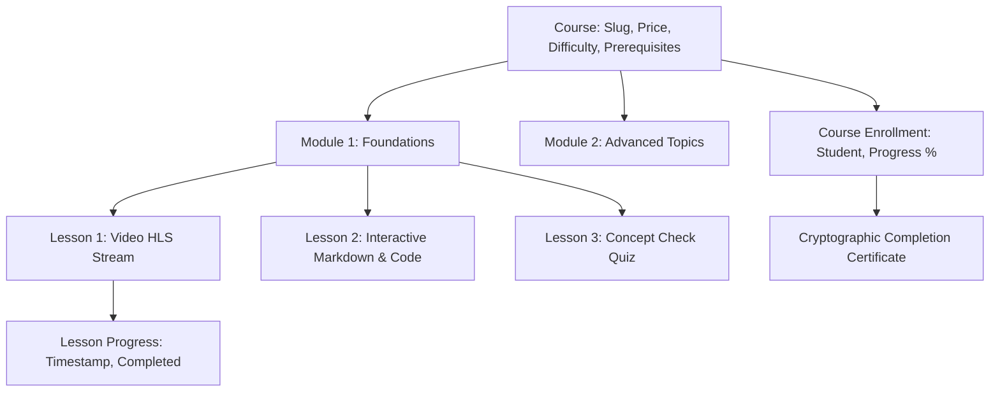

# COURSES LMS ENGINE — ARCHITECTURAL SPECIFICATION

> **Module:** `apps.courses`  
> **Status:** PRODUCTION CANONICAL  
> **Target Date:** September 2026  

---

## 1. LMS DOMAIN ENTITIES & HIERARCHY

---

## 2. KEY CAPABILITIES

1. **Video Streaming & HLS Transcoding**:
   - Master video uploads processed asynchronously via Celery worker (`generate_course_hls_task`).
   - Generates adaptive bitrate HLS playlists (`720p`, `1080p`, `480p`) with segmented `.ts` files.
2. **Progress & Completion Engine**:
   - `LessonProgress` tracks video watch seconds and completion booleans.
   - When all mandatory lessons reach `completed = True`, a Django signal triggers `generate_certificate_pdf_task`.
3. **Cryptographic Certificate Issuance**:
   - Generates unique verification code: `CERT-<COURSE_PREFIX>-<HEX12>`.
   - Embeds verifiable SHA-256 hash in metadata and outputs signed PDF stored in `media/certificates/`.
