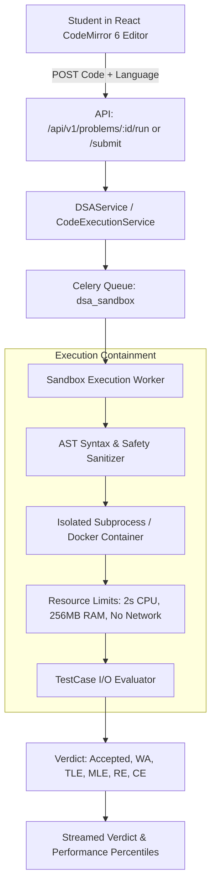

# DSA ENGINE & SANDBOX — ARCHITECTURAL SPECIFICATION

> **Module:** `apps.dsa`  
> **Status:** PRODUCTION CANONICAL  
> **Target Date:** September 2026  

---

## 1. LEETCODE-STYLE PLATFORM ARCHITECTURE

---

## 2. SANDBOX EXECUTION & SECURITY CONTAINMENT

### Supported Languages
1. **Python 3.13**: AST inspection blocks `os.system`, `subprocess`, `open`, `__import__('socket')`.
2. **C++ (GCC / Clang)**: Compiled with `-O2 -std=c++20 -static`.
3. **C (GCC)**: Compiled with `-O2 -std=c17`.
4. **Java (OpenJDK 21)**: Executed with `-Xmx256m -Xss16m -Djava.security.manager`.
5. **JavaScript (Node.js)**: Executed inside isolated VM context.

### Execution Safeguards
- **Time Limits**: Strict process kill via `subprocess.run(timeout=2.0)`.
- **Memory Containment**: Linux cgroups memory limit `256MB` (or Windows Job Object memory limits).
- **Network Isolation**: Disabled network egress during code compilation and execution.
