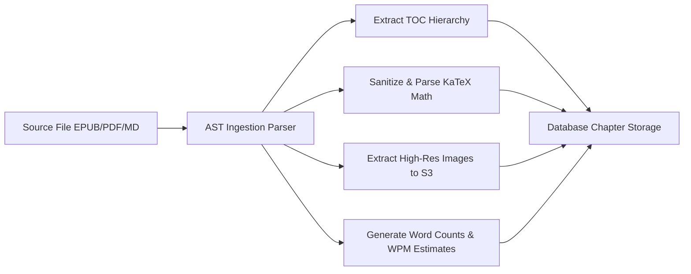

# EBOOK SUPREME ENGINE — ARCHITECTURAL SPECIFICATION

> **System Component:** `apps.ebooks` & `EbookReaderPage`  
> **Status:** CANONICAL PRODUCTION ARCHITECTURE  
> **Engineering Level:** Principal UI/UX Architect & Staff Systems Engineer  
> **Target Release:** LearningHub V8.0 (September 2026)  
> **Stack:** React 18 + Vite + Tailwind CSS (Client) / Django REST Framework + PostgreSQL 16 (Server)  

---

## 1. EBOOK ENGINE PHILOSOPHY & USER EXPERIENCE

The Ebook Supreme Engine is a next-generation technical reading platform combining the typography of **Kindle**, the structured modularity of **Notion**, and the mathematical typesetting of **LaTeX/KaTeX**. It delivers:
1. **Flawless Fluid Typography:** Custom type scaling, serif/sans-serif toggling, customizable line height ($1.4\times - 2.0\times$), page margins ($480\text{px} - 960\text{px}$ reading column), and three calibrated reading themes (Day White, Sepia Parchment, Midnight OLED).
2. **First-Class Technical Content:** Native rendering of complex math ($\LaTeX$), interactive executable code snippets, SVG architectural diagrams, and structured callout blocks.
3. **Resilient DOM Range Annotations:** Multi-color highlighting with persistent character offset anchors that survive responsive reflows and font-size adjustments.
4. **Instant Offline Availability:** Progressive Web App (PWA) offline caching with service worker prefetching and IndexedDB sync queues.
5. **Contextual Study Sidebar:** Collapsible Cornell notes workspace, live chapter table of contents, bookmark drawer, and inline AI tutor copilot.

---

## 2. READER INTERFACE ARCHITECTURE (`EbookReaderPage.tsx`)

The reading viewport is divided into three coordinated architectural layers:

```
┌────────────────────────────────────────────────────────────────────────┐
│ TOP APP BAR: Book Title | Chapter Progress Bar | Theme | AI Copilot    │
├─────────────┬────────────────────────────────────────────┬─────────────┤
│ NAVIGATION  │ READING VIEWPORT                           │ STUDY TOOLS │
│ DRAWER      │ (Distraction-Free / Focused Column)        │ SIDEBAR     │
│             │                                            │             │
│ • Chapter 1 │ # Chapter 2: Quantum Information Dynamics  │ [A.I. Copilot│
│ • Chapter 2 │                                            │  Chat / Q&A]│
│   - 2.1 Qubits│ The state of a qubit is represented as a   │             │
│   - 2.2 Gates │ superposition:                             │ [Highlights │
│ • Chapter 3 │   $$|\psi\rangle = \alpha|0\rangle +       │  & Notes]   │
│ • Bookmarks │                   \beta|1\rangle$$         │             │
│             │ where $|\alpha|^2 + |\beta|^2 = 1$.        │ [Flashcards │
│ • Glossary  │ [Highlight: "superposition of states" ✎]  │  Deck (SM2)]│
├─────────────┴────────────────────────────────────────────┴─────────────┤
│ FOOTER BAR: Chapter 2 of 14 | Page 42/180 | 18 min left in chapter     │
└────────────────────────────────────────────────────────────────────────┘
```

### 2.1 Reading Themes Specification
- **Day White:** Background `#FFFFFF`, Text `#1A202C`, Link `#2563EB`, Accent `#3B82F6`.
- **Sepia Parchment:** Background `#FBF0D9`, Text `#433422`, Link `#8B4513`, Accent `#D97706`. Reduces eye strain during daylight reading sessions.
- **Midnight OLED:** Background `#0A0E17`, Text `#E2E8F0`, Link `#60A5FA`, Accent `#38BDF8`. Pure black conservation for AMOLED mobile and nighttime desktop viewing.

---

## 3. RESILIENT HIGHLIGHTING & ANCHORING ENGINE

Traditional web highlights break when fonts or container widths change. The Ebook Supreme Engine uses **Normalized Text Offset Anchoring**:

### 3.1 Anchor Schema (`EbookHighlight`)
```sql
CREATE TABLE ebooks_ebookhighlight (
    id UUID PRIMARY KEY DEFAULT gen_random_uuid(),
    user_id BIGINT REFERENCES auth_user(id) ON DELETE CASCADE,
    ebook_id UUID REFERENCES ebooks_ebook(id) ON DELETE CASCADE,
    chapter_id UUID REFERENCES ebooks_ebookchapter(id) ON DELETE CASCADE,
    
    -- Exact Text Slice
    selected_text TEXT NOT NULL,
    prefix_context VARCHAR(128) NOT NULL, -- 32 characters preceding selection
    suffix_context VARCHAR(128) NOT NULL, -- 32 characters succeeding selection
    
    -- Character Offsets inside Chapter AST
    start_char_offset INTEGER NOT NULL,
    end_char_offset INTEGER NOT NULL,
    dom_xpath VARCHAR(256),
    
    -- Styling & Notes
    color VARCHAR(16) DEFAULT 'yellow', -- yellow, green, blue, pink, purple
    note TEXT DEFAULT '',
    is_public_annotation BOOLEAN DEFAULT FALSE,
    
    created_at TIMESTAMP WITH TIME ZONE DEFAULT NOW(),
    updated_at TIMESTAMP WITH TIME ZONE DEFAULT NOW()
);

CREATE INDEX idx_highlight_lookup ON ebooks_ebookhighlight (ebook_id, user_id, chapter_id);
```

### 3.2 Robust Re-Anchoring Algorithm
When rendering highlights:
1. Try direct exact match at `[start_char_offset, end_char_offset]`.
2. If text differs (due to revision), execute fuzzy substring search using Levenshtein distance bounded by `prefix_context` and `suffix_context`.
3. Wrap matching DOM nodes in dynamic `<mark class="lh-highlight lh-highlight-{color}">` spans without altering underlying Markdown text.

---

## 4. READING PROGRESS & VELOCITY TRACKING

The frontend continuously monitors reading engagement without being intrusive:

### 4.1 Real-Time Velocity Telemetry
- **Intersection Observer:** Divides chapter into 100-word block zones. As blocks enter viewport for $\ge 3$ seconds, they are marked as read.
- **Active Dwell vs Idle Detection:** Tracks mouse movement, scroll velocity, and touch gestures. If idle for $> 45$ seconds, dwell timer pauses automatically to prevent inflated reading statistics.
- **Reading Speed Metric:** Words per minute (WPM) computed as:
  $$\text{WPM} = \frac{\text{Words in Read Blocks}}{\text{Active Reading Seconds} / 60}$$

### 4.2 Sync Protocol
Reading state is synced via debounced HTTP payload every 15 seconds or on chapter transition:
```json
{
  "ebook_id": "c7b89e24-4f1b-419b-a621-391807d3b0e1",
  "chapter_id": "a9018e42-9901-4b12-b103-018293746a81",
  "scroll_percentage": 68.4,
  "last_read_char_offset": 4520,
  "active_dwell_seconds": 185,
  "wpm": 238
}
```

---

## 5. CONTENT INGESTION PIPELINE (EPUB / PDF / MARKDOWN)

Content enters the system through an automated ingestion worker:



1. **KaTeX Pre-Compilation:** Formulas like `$\sum_{i=1}^n i = \frac{n(n+1)}{2}$` are validated during ingestion. Syntax errors alert the content admin before publication.
2. **Code Syntax Highlighting:** Code blocks in 40+ languages are tagged with prism/highlight tokens for sub-millisecond client rendering.
3. **Table of Contents (TOC):** Automatically extracts $H1, H2, H3$ headers into a nested navigation tree.
