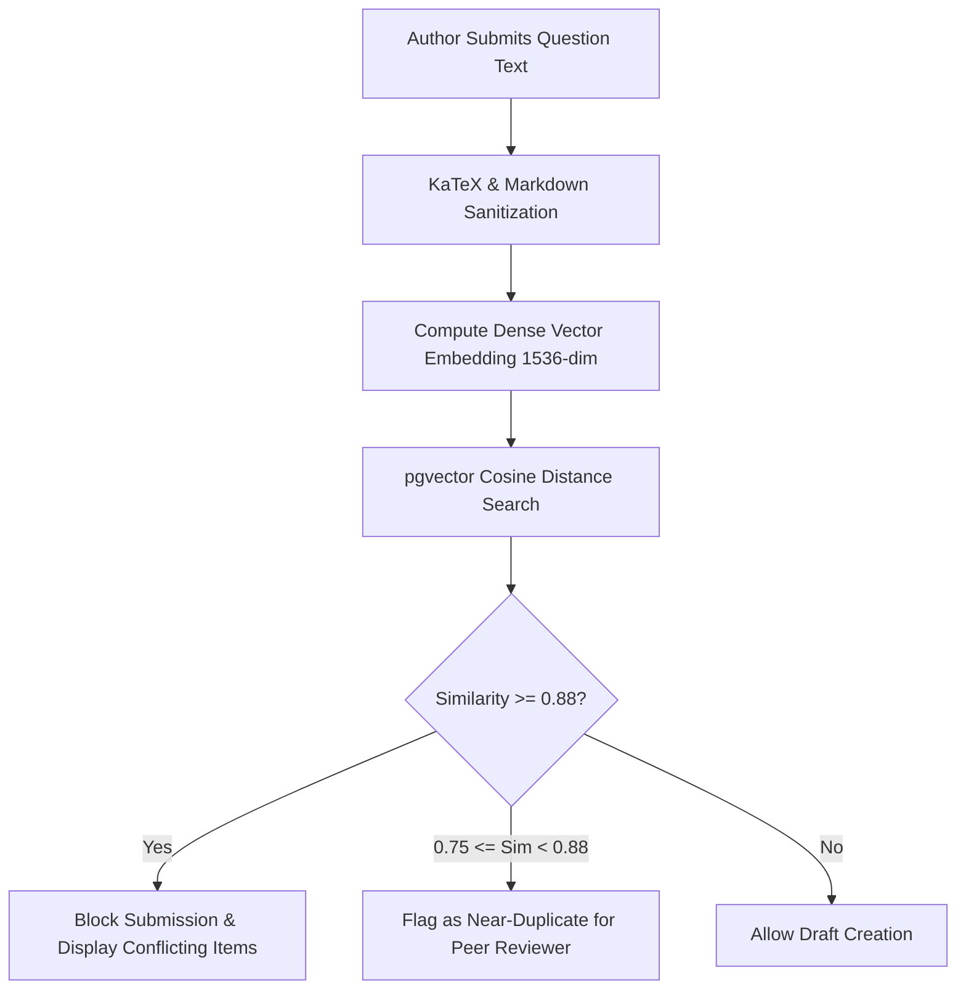

# ENTERPRISE QUESTION BANK 3.0 SPECIFICATION

> **System Component:** `apps.tests_engine.question_bank`  
> **Status:** CANONICAL PRODUCTION SPECIFICATION  
> **Engineering Level:** Staff Assessment Systems Architect & Data Scientist  
> **Target Release:** LearningHub V8.0 (September 2026)  
> **Database:** PostgreSQL 16 + `pgvector`  

---

## 1. QUESTION BANK PHILOSOPHY & OBJECTIVES

The Question Bank 3.0 is a centralized, high-integrity content repository powering national mock exams, adaptive computerized tests, and practice drills. Its design guarantees:
1. **Curricular Alignment & Cognitive Depth:** Every item is indexed with hierarchical taxonomies (Subject $\to$ Topic $\to$ Subtopic) and Bloom's Revised Taxonomy cognitive levels.
2. **Mathematically Rigorous Calibration:** Items store empirical Item Response Theory (IRT 3PL) parameters ($a, b, c$) continuously updated by Bayesian scoring workers.
3. **Semantic Duplicate Prevention:** Embeddings indexed via `pgvector` reject near-duplicate questions at creation time.
4. **Authoring Quality & Version Audit:** Multi-tier peer review workflow with immutable historical version tracking.

---

## 2. CANONICAL QUESTION DATA SCHEMA

```sql
CREATE TABLE tests_engine_question (
    id UUID PRIMARY KEY DEFAULT gen_random_uuid(),
    code VARCHAR(64) UNIQUE NOT NULL, -- Human-readable identifier e.g. "PHY-MECH-042"
    question_text TEXT NOT NULL,      -- Full Markdown supporting KaTeX: e.g. $\int_0^\infty e^{-x^2} dx$
    question_type VARCHAR(32) NOT NULL, -- MCQ, MULTI_SELECT, NUMERICAL, SUBJECTIVE, MATRIX_MATCH, ASSERTION_REASON
    difficulty_level INTEGER CHECK (difficulty_level BETWEEN 1 AND 5),
    bloom_taxonomy VARCHAR(32) NOT NULL, -- REMEMBER, UNDERSTAND, APPLY, ANALYZE, EVALUATE, CREATE
    
    -- Item Response Theory (3PL) Parameters
    irt_discrimination NUMERIC(5, 3) DEFAULT 1.000, -- 'a' parameter [0.2, 3.0]
    irt_difficulty NUMERIC(5, 3) DEFAULT 0.000,     -- 'b' parameter [-3.0, +3.0]
    irt_guessing NUMERIC(5, 3) DEFAULT 0.250,       -- 'c' parameter [0.0, 0.5]
    
    -- Content Metadata & Taxonomies
    subject_id UUID REFERENCES courses_category(id),
    topic VARCHAR(128) NOT NULL,
    subtopic VARCHAR(128) NOT NULL,
    tags JSONB DEFAULT '[]'::jsonb,
    
    -- Solution & Hints
    explanation TEXT NOT NULL,
    solution_video_url VARCHAR(512),
    hints JSONB DEFAULT '[]'::jsonb, -- Incremental progressive hints
    
    -- Semantic Search & Deduplication
    text_embedding vector(1536), -- OpenAI text-embedding-3-small or GTE-large
    
    -- Authoring Lifecycle
    status VARCHAR(32) DEFAULT 'DRAFT', -- DRAFT, PENDING_REVIEW, APPROVED, PUBLISHED, FLAGGED_REVISION, ARCHIVED
    version INTEGER DEFAULT 1,
    author_id BIGINT REFERENCES auth_user(id),
    reviewed_by_id BIGINT REFERENCES auth_user(id),
    created_at TIMESTAMP WITH TIME ZONE DEFAULT NOW(),
    updated_at TIMESTAMP WITH TIME ZONE DEFAULT NOW()
);

CREATE INDEX idx_question_embedding ON tests_engine_question USING ivfflat (text_embedding vector_cosine_ops) WITH (lists = 100);
CREATE INDEX idx_question_taxonomies ON tests_engine_question (topic, subtopic, difficulty_level);
```

### 2.1 Bloom's Taxonomy Cognitive Classification
| Level | Cognitive Action | Target Assessment Format |
| :--- | :--- | :--- |
| **1. Remember** | Recall facts, formulas, definitions, dates | Direct Single-Choice MCQ, Fill-in-the-Blank |
| **2. Understand** | Explain concepts, classify relationships, summarize | Multiple-Select, Assertion-Reasoning |
| **3. Apply** | Execute algorithms, compute numerical calculations | Numerical Value Question (NVQ) |
| **4. Analyze** | Differentiate causes, examine data tables/graphs | Matrix Match, Multi-Step Problem Solving |
| **5. Evaluate** | Judge validity, detect logical fallacies | Proof verification, Diagnostic Case Study |
| **6. Create** | Design algorithms, synthesize architectural plans | Subjective / Code implementation |

---

## 3. SEMANTIC DUPLICATE DETECTION PIPELINE

To protect question banks from accidental duplicates or plagiarized submissions, an automated deduplication pipeline evaluates every newly submitted question:



### 3.1 Cosine Similarity Threshold Rules
- **Cosine Similarity $\ge 0.88$:** Immediate duplicate block. The system highlights the existing question code and prevents saving.
- **Cosine Similarity $0.75 \le \text{Sim} < 0.88$:** Permitted with a warning banner: *"Warning: Similar question exists in database (`PHY-MECH-019`). Author must verify divergence."*
- **Cosine Similarity $< 0.75$:** Unique item accepted into peer review pipeline.

---

## 4. MULTI-STAGE PEER REVIEW & CONTENT MODERATION

Every question undergoes a strict 4-eye verification workflow before appearing in national mock exams:

```
[DRAFT] ──> [PENDING_REVIEW] ──> [APPROVED] ──> [PUBLISHED]
                 │                     │
                 └──> [FLAGGED_REVISION] └──> [ARCHIVED]
```

1. **Author Draft:** Instructor drafts question text, options, KaTeX equations, and step-by-step solution.
2. **Peer Review:** A verified Subject Matter Expert (SME) audits:
   - Mathematical and factual correctness.
   - Quality of distractor options (no trivial or nonsensical choices).
   - KaTeX rendering integrity and grammar.
   - Difficulty level and Bloom's classification.
3. **Approval:** Reviewer signs off cryptographically with timestamp and notes.
4. **Publishing:** System makes item available to the Test Builder and Adaptive Engine.

---

## 5. BULK INGESTION & EXPORT ENGINE

The system provides validated bulk ingestion supporting up to 5,000 questions per batch:

### 5.1 Supported Formats
- **Excel (.xlsx) / CSV:** Template with columns `code`, `type`, `question_text`, `opt_a`, `opt_b`, `opt_c`, `opt_d`, `correct_opt`, `marks`, `neg_marks`, `explanation`, `topic`, `difficulty`.
- **JSON (Canonical Schema):** Standard array of serialized question objects with embedded options.
- **QTI 2.1 / 3.0 (IMS Global):** Industry standard XML export format for integration with external learning management systems.

### 5.2 Dry-Run Validation Suite
Prior to database commit, bulk uploads execute a dry-run checking:
- KaTeX syntax validation: catches unclosed brackets like `$\frac{1}{2$`.
- Option correctness invariant: exactly one option flagged `is_correct=True` for MCQ.
- Numeric bounds: non-negative marks, valid difficulty ($1-5$).
- Duplicate codes: ensures codes are unique across the database.

---

## 6. EMPIRICAL ITEM METRICS & RETIREMENT CRITERIA

Questions undergo periodic statistical calibration via Celery Beat jobs after accumulating $\ge 100$ student attempts:

### 6.1 Item Discrimination Index ($D$)
$$D = \frac{R_U - R_L}{N_{\text{group}}}$$
where:
- $R_U$ is correct answers in the top $27\%$ score bracket.
- $R_L$ is correct answers in the bottom $27\%$ score bracket.
- $N_{\text{group}}$ is student count in either group.
- **Rule:** If $D < 0.20$, the item has poor discrimination (high performers are failing it or low performers are guessing it). The item is automatically flagged for SME audit.

### 6.2 Point-Biserial Correlation ($r_{\text{pbis}}$)
$$r_{\text{pbis}} = \frac{\bar{X}_1 - \bar{X}_0}{s_X} \sqrt{p(1 - p)}$$
Items with $r_{\text{pbis}} < 0.15$ are deprecated and prevented from appearing in future mock exams.
