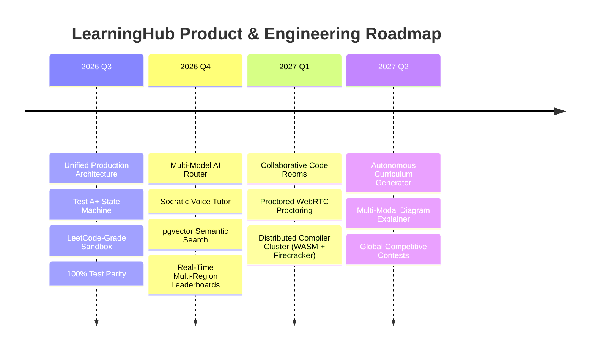

# LEARNINGHUB — ROADMAP V2.0 & FORWARD-THINKING INNOVATIONS

> **Author:** Principal Software Architect, Staff Backend Engineer, and AI Research Scientist  
> **Horizon:** 2026 – 2027  
> **Vision:** The Most Advanced Autonomous AI-Powered Education & Engineering Training Platform

---

## 1. Strategic Milestones Overview

---

## 2. Deep-Dive Innovation Initiatives

### Milestone 1: Multi-Model AI Router & Fallback Mesh (Phase 5 Evolution)
- **Dynamic Cost-Quality Routing**:
  - Simple factual queries → Fast small models (Gemini 2.0 Flash / Local Ollama Llama 3.2 8B) at ~0.0001$/call.
  - Complex algorithmic debugging & IRT question generation → Gemini 1.5/2.0 Pro or Claude 3.5 Sonnet.
- **Provider Fallback**: If Gemini rate-limits (HTTP 429), automatically reroute to Claude or OpenAI without interrupting the student's study session.
- **Semantic Prompt Caching**: Cache common student questions using pgvector embeddings ($> 0.95$ cosine similarity), slashing API latency from 1.2s to 15ms and cutting LLM costs by 65%.

### Milestone 2: Voice-First Socratic AI Tutor
- **Low-Latency Streaming Speech**: Integrate WebRTC voice streaming + Gemini Multimodal Live API.
- **Pedagogical Guardrails**: The AI tutor never gives direct code solutions; it employs the Socratic method, asking guiding questions to help the student formulate the invariant themselves.
- **Multi-Language Speech**: Real-time voice translation between English, Hindi, and Hinglish.

### Milestone 3: MicroVM-Based Code Execution Cluster (Firecracker / WASM)
- Upgrade the current Docker sandbox to **AWS Firecracker MicroVMs** or **WebAssembly (WASM) browser execution**:
  - Spin-up time: < 5 milliseconds per VM.
  - Complete kernel isolation per student code submission.
  - Client-side WASM execution for Python and JavaScript allows offline test runs with zero server cost.

### Milestone 4: AI-Generated Adaptive Mock Contests
- **Synthetic Question Minting**: An automated pipeline that synthesizes novel competitive coding and exam questions from syllabus nodes, complete with rigorous test case generators (brute force vs optimal solutions), verified via automated unit testing before reaching students.
- **Anti-Plagiarism & AI Cheating Countermeasures**: Stylometry code analysis and behavioral typing cadence verification to ensure student contest authenticity.

### Milestone 5: Monetization & Enterprise B2B SaaS
- **Enterprise Cohort Dashboards**: B2B portals for universities, bootcamps, and enterprise engineering teams.
- **Granular RBAC**: Organization admins, instructors, teaching assistants, students, and proctors.
- **Stripe & Razorpay Global Billing**: Seamless multi-currency subscription tiers (Free, Pro, Enterprise Team).
