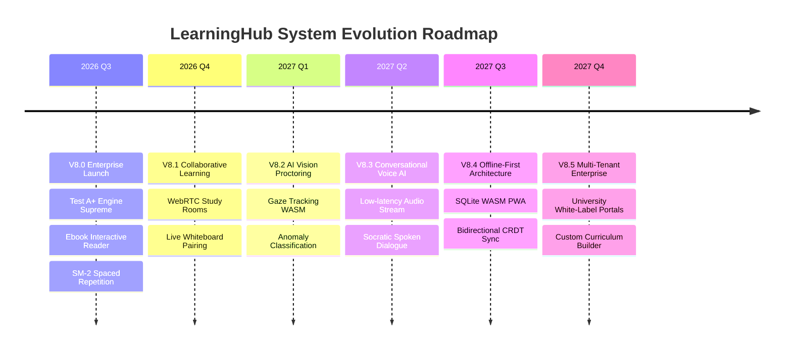

# LEARNINGHUB V8.0 — STRATEGIC PREMORTEM & FUTURE EVOLUTION ROADMAP

> **Document Status:** CANONICAL STRATEGIC ROADMAP  
> **Engineering Level:** Startup CTO & Principal Systems Architect  
> **Target Release:** LearningHub V8.0 to V8.5 (2026 - 2027)  
> **Core Focus:** Failure Mode Premortem, Hardening, and High-Impact Innovation  

---

## 1. STRATEGIC PREMORTEM ANALYSIS: ANTICIPATING CRITICAL FAILURES

A disciplined engineering organization assumes systems *will* fail under real-world stress and designs proactive mitigations before incidents occur.

### Failure Scenario 1: The "10:00:00 AM National Mock Exam" Thundering Herd
- **The Threat:** 50,000 concurrent students hit the "Start Exam" button within a 3-second window. The sudden burst of 50,000 database `INSERT INTO test_attempt` statements exhausts the PostgreSQL connection pool, triggering cascading timeouts (HTTP 504) and student panic.
- **V8 Mitigation Architecture:**
  1. **Pre-Warmed Attempt Tickets:** When a student registers for a scheduled mock exam, an attempt token is pre-generated and stored in Redis 24 hours in advance.
  2. **Jittered Question Delivery:** Client requests are staggered with a random 0–3,500ms client-side jitter window.
  3. **Read Replica Decoupling:** Static exam questions and options are served exclusively from Redis or read replicas, bypassing the primary database entirely during test initialization.

### Failure Scenario 2: Network Drop During Critical Test Submission
- **The Threat:** A student completes a 3-hour exam and clicks "Submit", but their mobile broadband drops out, resulting in an unconfirmed submission or a timed-out session marked as zero.
- **V8 Mitigation Architecture:**
  1. **Optimistic Local Completion:** The client immediately saves the final submission bundle into `IndexedDB` with an immutable SHA-256 state hash.
  2. **Exponential Backoff Background Sync:** A background Service Worker attempts resubmission every 5 seconds for up to 2 hours.
  3. **Server Grace Period:** The backend grants an automatic 5-minute network tolerance window past `started_at + duration` before marking active attempts as `TIMED_OUT`.

### Failure Scenario 3: AI Tutor Hallucination on Complex STEM Derivations
- **The Threat:** The AI Tutor invents a false mathematical theorem or provides an incorrect numerical solution, damaging platform credibility.
- **V8 Mitigation Architecture:**
  1. **Grounding in Canonical Text:** The AI system prompt is strictly constrained: *"You are an AI teaching assistant. You must ONLY answer using the provided chapter context and formulas. If the context does not contain the answer, state that explicitly."*
  2. **KaTeX Syntax Gate:** All formulas in AI responses pass through an AST validator before reaching the client; malformed LaTeX triggers an immediate regeneration.
  3. **Confidence Scoring:** Outputs with low model confidence are marked with an icon: *"Experimental AI derivation — verify with textbook chapter."*

### Failure Scenario 4: Write Contention on Real-Time Leaderboards
- **The Threat:** As thousands of students submit tests simultaneously, database updates to user XP and rank tables cause row lock contention.
- **V8 Mitigation Architecture:**
  - Real-time leaderboard updates are executed exclusively in Redis Sorted Sets (`ZINCRBY leaderboard:weekly <xp> <user_id>`).
  - A Celery Beat task persists final leaderboard rankings to PostgreSQL once every 15 minutes, decoupling real-time UI queries from relational disk writes.

---

## 2. SYSTEMIC EVOLUTION ROADMAP (V8.0 ➔ V8.5)

### V8.1 — Collaborative Study Rooms & Peer Whiteboarding (Q4 2026)
- **Feature:** Live peer-to-peer study rooms where students can solve problems together.
- **Architecture:** WebSockets via Django Channels for presence signaling, WebRTC mesh for peer audio, and Fabric.js canvas synchronized via operational transformation.

### V8.2 — Client-Side AI Proctoring via WebAssembly (Q1 2027)
- **Feature:** Privacy-preserving proctoring that runs directly in the student's browser without uploading private video feeds to servers.
- **Architecture:** MediaPipe / TensorFlow.js compiled to WebAssembly detecting gaze deviations, multiple faces in frame, and secondary mobile screen presence. Only aggregate metadata flags are sent to the backend.

### V8.3 — Real-Time Conversational Voice AI Tutor (Q2 2027)
- **Feature:** Low-latency conversational voice partner for auditory learners.
- **Architecture:** Bi-directional WebSockets streaming audio PCM packets to Gemini Live / Whisper API with sub-800ms spoken turn-around time.

### V8.4 — Offline-First PWA with CRDT Synchronization (Q3 2027)
- **Feature:** Complete textbook reading, highlighting, and practice quiz execution with zero internet connectivity.
- **Architecture:** SQLite running in browser via WebAssembly (OPFS storage) with Conflict-Free Replicated Data Types (CRDTs) resolving edits upon reconnection.

### V8.5 — Institutional Multi-Tenancy & White-Label Enterprise (Q4 2027)
- **Feature:** Support for schools, universities, and test-prep institutions to host private curriculums under custom domain names.
- **Architecture:** PostgreSQL schema-per-tenant or row-level tenant security (`tenant_id`), automated SSL certificate issuance via Let's Encrypt / Caddy, and institutional role hierarchies.
