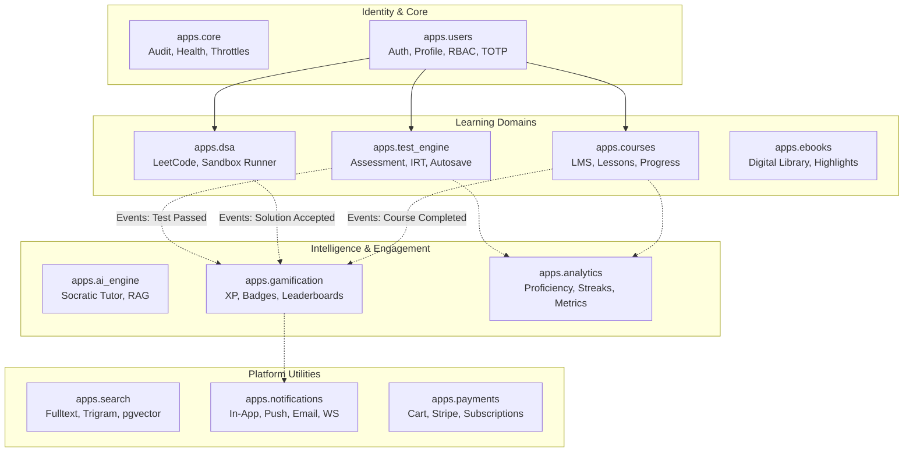

# LEARNINGHUB V5.0 — SYSTEM ARCHITECTURE SPECIFICATION

> **Architecture:** Django Clean Architecture (HackSoft Style: Services & Selectors)  
> **Status:** PRODUCTION CANONICAL  
> **Target Date:** September 2026  

---

## 1. ARCHITECTURAL PATTERN & DIRECTORY LAYOUT

LearningHub V5.0 adopts the **HackSoft Django Styleguide** pattern. All business logic, writes, transactions, and side-effects are decoupled into `services.py`. All complex queries, prefetching, aggregation, and caching are isolated into `selectors.py`. Views act strictly as thin HTTP request-response controllers.

```
apps/
├── <domain_app>/
│   ├── __init__.py
│   ├── admin.py          # Django Admin registration with search & filters
│   ├── apps.py           # AppConfig
│   ├── models.py         # Declarative schema, constraints, indexes
│   ├── permissions.py    # Fine-grained DRF permissions (RBAC)
│   ├── selectors.py      # PURE READS: Queries, prefetching, cached filters
│   ├── serializers.py    # DRF input validation & JSON schema serializers
│   ├── services.py       # PURE WRITES: Mutations, atomic transactions, side-effects
│   ├── signals.py        # Domain event dispatchers
│   ├── tasks.py          # Celery background jobs
│   ├── urls.py           # RESTful URL patterns
│   ├── validators.py     # Clean domain-level validation logic
│   ├── views.py          # Thin DRF APIViews dispatching to services & selectors
│   └── tests/            # Pytest test suite (unit & integration)
```

---

## 2. THE 12 CANONICAL DOMAIN BOUNDARIES



---

## 3. REQUEST-RESPONSE LIFECYCLE

1. **Edge/Reverse Proxy**: Nginx SSL termination or Daphne direct TLS.
2. **Middleware Pipeline**:
   - `PrometheusBeforeMiddleware` records request start time.
   - `CorsMiddleware` checks origin whitelist.
   - `SecurityHeadersMiddleware` & `CSPMiddleware` enforce browser isolation.
   - `InputSanitizationMiddleware` strips malicious script payloads.
   - `CSRFHeaderNormalizerMiddleware` binds CSRF token.
   - `AuthenticationMiddleware` parses SimpleJWT bearer headers and authenticates user.
   - `AuditMiddleware` generates `X-Request-ID` and logs telemetry to `AuditLog`.
   - `AxesMiddleware` monitors failed login attempts.
3. **DRF Thin View Controller**:
   - Parses input JSON through `serializers.py` validation.
   - Checks permissions via `permissions.py`.
   - Dispatches write operations to `services.py` inside `transaction.atomic()`.
   - Or dispatches read queries to `selectors.py` with pre-cached results.
4. **Response Formatting**:
   - Returns uniform envelope: `{"status": "success", "data": {...}, "message": "..."}` or `{"status": "error", "message": "..."}`.
