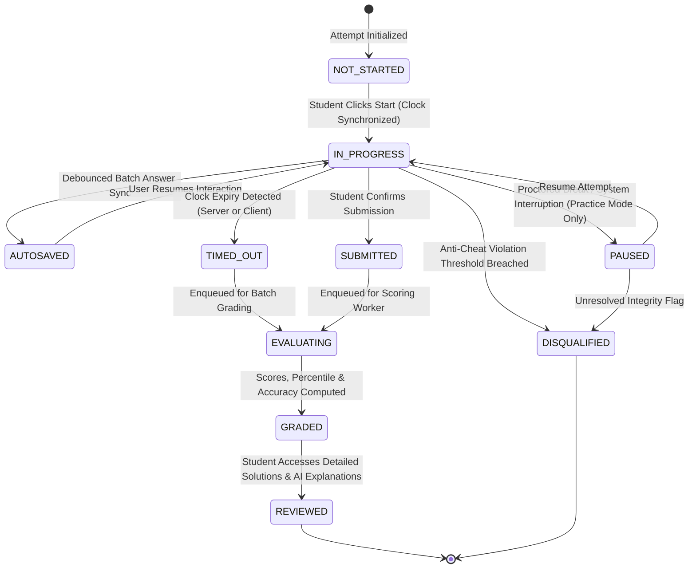

# TEST A+ ENGINE — SUPREME ARCHITECTURAL SPECIFICATION

> **Module Identifier:** `apps.tests_engine`  
> **Status:** CANONICAL PRODUCTION ARCHITECTURE  
> **Engineering Level:** Staff Systems Architect & Lead Assessment Engineer  
> **Target Release:** LearningHub V8.0 (September 2026)  
> **Core Stack:** Django REST Framework + PostgreSQL 16 + Redis 7.2 + Celery 5.4  

---

## 1. ASSESSMENT ENGINE DOMAIN MODEL & PHILOSOPHY

The Test A+ Assessment Engine is designed for national-level mock exams, adaptive computerized classification testing, high-stakes contests, and daily rapid-fire diagnostic practice. It guarantees:
1. **Sub-second Autosave Latency (<50ms):** Zero student work loss under browser crashes or network dropouts.
2. **Deterministic High-Precision Scoring:** Exact fractional marking, negative penalties, and partial credit evaluation.
3. **Item Response Theory (IRT):** Adaptive computerized testing adjusting item difficulty in real time according to the 3-Parameter Logistic (3PL) model.
4. **Resilient Anti-Cheat Telemetry:** Continuous logging of focus loss, tab switching, window resizing, and anomalous latency patterns.
5. **Offline Recovery & Eventual Consistency:** Local browser buffering (IndexedDB) with idempotent replay against server state.

---

## 2. THE 10-STATE ATTEMPT FINITE STATE MACHINE (FSM)

Every student assessment session transitions through a strictly guarded 10-state finite state machine:



### 2.1 State Transitions & Enforcement Rules
| Transition | Origin State | Destination State | Trigger & Enforcement Mechanism |
| :--- | :--- | :--- | :--- |
| `START_EXAM` | `NOT_STARTED` | `IN_PROGRESS` | Server generates cryptographically signed attempt token; server clock sets `started_at` timestamp. |
| `AUTOSAVE_HEARTBEAT` | `IN_PROGRESS` | `AUTOSAVED` | Client triggers debounced REST `PATCH /autosave/` every 3 seconds if state dirty; Redis updates dirty state. |
| `TIMER_EXPIRY` | `IN_PROGRESS` | `TIMED_OUT` | Server-side Celery beat task sweeps active attempts where `now() > started_at + duration + grace_period`. |
| `STUDENT_SUBMIT` | `IN_PROGRESS` | `SUBMITTED` | Client sends final submission payload; server locks attempt from further answer mutations. |
| `EVALUATE_ATTEMPT` | `SUBMITTED`/`TIMED_OUT` | `EVALUATING` | Celery task `evaluate_test_attempt(attempt_id)` acquires advisory lock and parses all question answers. |
| `FINALIZE_REPORT` | `EVALUATING` | `GRADED` | Raw score, negative marks, net score, topic breakdown, and percentile ranks calculated atomically. |
| `STUDENT_REVIEW` | `GRADED` | `REVIEWED` | Explanations, solution video links, and KaTeX mathematical step-by-step breakdowns unlocked. |
| `INTEGRITY_BREACH` | Any active | `DISQUALIFIED` | Continuous anti-cheat telemetry records > 5 critical violations (e.g. persistent tab blur > 60s in proctored exam). |

---

## 3. QUESTION TYPES & MATHEMATICAL SCORING ALGORITHMS

The Test A+ engine supports 7 canonical question formats with configurable scoring rubrics:

### 3.1 Supported Question Formats
1. **Single Choice Multiple Choice (MCQ):** Standard 4-option single correct answer.
2. **Multiple Select (MSQ):** 1 to $N$ correct options. Supports optional partial marking:
   $$\text{Score} = \max\left(0, \frac{\text{Correct Selected}}{\text{Total Correct}} \times \text{Marks} - \frac{\text{Incorrect Selected}}{\text{Total Incorrect}} \times \text{Marks}\right)$$
3. **Numerical Value Question (NVQ):** Floating-point or integer answer with configurable absolute tolerance $\epsilon$:
   $$\text{IsCorrect} = |x_{\text{user}} - x_{\text{actual}}| \le \epsilon$$
4. **Fill In The Blank (FIB):** Regex-normalized string matching, case-insensitive with whitespace trimming and synonym dictionary support.
5. **Matrix Match / Column Association:** $M \times N$ matching grid with bipartite correctness verification.
6. **Assertion-Reasoning:** Standard entrance exam format testing relational logical inference between two statements.
7. **Subjective / Descriptive:** Text submission with AI rubric-based evaluation and human grader override workflows.

### 3.2 Universal Net Score Formulation
For a test with $Q$ questions, net score $S_{\text{net}}$ is calculated deterministically:
$$S_{\text{net}} = \sum_{i \in \text{Correct}} M_i - \sum_{j \in \text{Incorrect}} (M_j \times \rho) + \sum_{k \in \text{Partial}} M_{k,\text{partial}}$$
where:
- $M_i$ is the maximum positive marks assigned to question $i$.
- $\rho \in [0.0, 1.0]$ is the negative marking penalty factor (typically $\rho = 0.25$ or $\rho = 0.333$).
- Unattempted questions receive $0$ marks and incur zero penalty.

---

## 4. ITEM RESPONSE THEORY (IRT) 3PL ADAPTIVE ENGINE

For adaptive computerized tests (`mode="ADAPTIVE_CAT"`), questions are chosen in real time based on the student's evolving latent ability parameter $\theta \in [-3.0, +3.0]$.

### 4.1 The 3-Parameter Logistic (3PL) Model
The probability that a student with latent ability $\theta$ answers question $i$ correctly is:
$$P_i(\theta) = c_i + \frac{1 - c_i}{1 + \exp\left(-a_i (\theta - b_i)\right)}$$
where:
- $a_i \in (0, 3]$: **Discrimination Parameter** (how steeply the question differentiates between high and low ability students).
- $b_i \in [-3, +3]$: **Difficulty Parameter** (the ability level at which the probability of answering correctly is $(1 + c_i)/2$).
- $c_i \in [0, 0.5]$: **Pseudo-Guessing Parameter** (the probability that a student with virtually no knowledge answers correctly by pure chance).

### 4.2 Fisher Information Function & Question Dispatching
To minimize measurement error, the next question selected is the one that maximizes Fisher Information at current ability estimate $\hat{\theta}$:
$$I_i(\hat{\theta}) = a_i^2 \frac{\left(P_i(\hat{\theta}) - c_i\right)^2}{\left(1 - c_i\right)^2} \frac{1 - P_i(\hat{\theta})}{P_i(\hat{\theta})}$$

### 4.3 Stopping Criteria for Adaptive Exams
An adaptive test terminates when either:
1. The Standard Error of Measurement falls below a precision threshold:
   $$\text{SE}(\hat{\theta}) = \frac{1}{\sqrt{\sum_{i=1}^n I_i(\hat{\theta})}} \le 0.20$$
2. The maximum allowable question count ($N_{\max} = 35$) is reached.

---

## 5. ANTI-CHEAT TELEMETRY & INTEGRITY MONITORING

The frontend `ExamInterfacePage` captures high-frequency client-side telemetry through non-intrusive event listeners and sends packed JSON telemetry to the backend on each autosave.

```json
{
  "telemetry": {
    "tab_switch_count": 2,
    "total_blur_duration_ms": 4200,
    "fullscreen_exit_count": 1,
    "copy_paste_attempts": 0,
    "window_resize_events": 3,
    "device_fingerprint": "a3f8901be9c4",
    "network_latency_ms": 42,
    "anomaly_flags": []
  }
}
```

### 5.1 Integrity Violation Scoring
- Tab Switch: +15 penalty points.
- Blur Duration > 10 seconds: +25 penalty points.
- Fullscreen Exit: +20 penalty points.
- Copy/Paste Attempt: +10 penalty points (and clipboard content blocked).
- **Disqualification Threshold:** When total penalty points exceed 100, the system displays an integrity warning, locks input, and transitions the attempt to `DISQUALIFIED` if unmitigated.

---

## 6. OFFLINE RESILIENCE & ATOMIC AUTOSAVE PIPELINE

### 6.1 IndexedDB Local Cache Layer
In case of network latency spikes or transient drops:
1. Every answer click is instantly written to the browser's `IndexedDB` local database with timestamp and optimistic dirty flag.
2. A debounced background worker flushes dirty answers every 3,000ms to `/api/v1/tests/attempts/<id>/autosave/`.
3. If an autosave fails due to `net::ERR_INTERNET_DISCONNECTED`, a persistent amber badge informs the user: *"Offline mode active — answers cached locally"*.
4. When connectivity restores, all buffered events are replayed with an idempotent transaction key to prevent race conditions.

### 6.2 Backend Autosave Processing
The backend autosave endpoint updates Redis cache immediately (`test_attempt:<id>:answers`) and schedules a Celery bulk insert to PostgreSQL, ensuring database writes are batch-consolidated under high concurrency.
