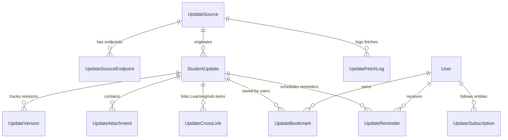

# LEARNINGHUB STUDENT UPDATES HUB — DATA MODEL SPECIFICATION (V1.0)

> **Database Engine:** PostgreSQL (Production) / SQLite (Development & Tests)  
> **Schema Standard:** Canonical Django Models with Indexes & Constraints  
> **Table Prefix:** `lh_update_*`  

---

## 1. ENTITY RELATIONSHIP ARCHITECTURE

---

## 2. CANONICAL MODEL DEFINITIONS (`apps/updates/models.py`)

### 2.1 `UpdateSource` (Source Registry)
- `source_id`: `CharField(primary_key=True, max_length=64)`
- `name`: `CharField(max_length=255)`
- `domain`: `CharField(max_length=255, db_index=True)`
- `source_type`: `CharField(choices=['UNIVERSITY', 'EXAM_BOARD', 'GOVERNMENT', 'COLLEGE'], max_length=32)`
- `authority_level`: `IntegerField(choices=[(1, 'Level 1'), (2, 'Level 2'), (3, 'Level 3'), (4, 'Level 4'), (5, 'Level 5')], default=1)`
- `category`: `CharField(max_length=64)`
- `country`: `CharField(max_length=64, default='India')`
- `state`: `CharField(max_length=64, default='Uttar Pradesh')`
- `institution`: `CharField(max_length=255)`
- `base_url`: `URLField(max_length=500)`
- `fetch_method`: `CharField(choices=['REST_API', 'RSS_FEED', 'HTML_TABLE', 'DOM_SCRAPE', 'MANUAL'], default='HTML_TABLE')`
- `polling_interval_minutes`: `IntegerField(default=60)`
- `robots_policy`: `CharField(default='COMPLIANT', max_length=32)`
- `terms_status`: `CharField(default='APPROVED', max_length=32)`
- `is_enabled`: `BooleanField(default=True, db_index=True)`
- `verification_required`: `BooleanField(default=False)`
- `last_success_at`: `DateTimeField(null=True, blank=True)`
- `last_failure_at`: `DateTimeField(null=True, blank=True)`
- `failure_count`: `IntegerField(default=0)`
- `last_content_hash`: `CharField(max_length=64, blank=True)`
- `last_checked_at`: `DateTimeField(null=True, blank=True)`

### 2.2 `StudentUpdate` (Core Normalized Notice)
- `id`: `CharField(primary_key=True, max_length=64)` (e.g. `upd-<uuid8>`)
- `source`: `ForeignKey(UpdateSource, on_delete=SET_NULL, null=True, related_name='updates')`
- `title`: `CharField(max_length=500, db_index=True)`
- `summary`: `TextField()`
- `ai_summary`: `TextField(blank=True, default='')`
- `is_ai_summarized`: `BooleanField(default=False)`
- `source_url`: `URLField(max_length=1000)`
- `category`: `CharField(choices=CATEGORY_CHOICES, max_length=64, db_index=True)`
- `sub_category`: `CharField(max_length=64, db_index=True)`
- `institution`: `CharField(max_length=255, db_index=True)`
- `exam`: `CharField(max_length=255, blank=True, default='')`
- `course`: `CharField(max_length=255, blank=True, default='')`
- `semester`: `CharField(max_length=64, blank=True, default='')`
- `session`: `CharField(max_length=64, blank=True, default='')`
- `published_at`: `DateTimeField(null=True, blank=True, db_index=True)`
- `effective_from`: `DateTimeField(null=True, blank=True)`
- `effective_until`: `DateTimeField(null=True, blank=True)`
- `deadline`: `DateTimeField(null=True, blank=True, db_index=True)`
- `event_date`: `DateTimeField(null=True, blank=True)`
- `status`: `CharField(choices=['DRAFT', 'PUBLISHED', 'ARCHIVED', 'REJECTED'], default='PUBLISHED', db_index=True)`
- `verification_status`: `CharField(choices=['VERIFIED', 'PENDING_REVIEW', 'FLAGGED'], default='VERIFIED', db_index=True)`
- `importance`: `CharField(choices=['NORMAL', 'IMPORTANT', 'URGENT'], default='NORMAL', db_index=True)`
- `audience`: `JSONField(default=dict, blank=True)`
- `language`: `CharField(max_length=16, default='en')`
- `content_hash`: `CharField(max_length=64, db_index=True)`
- `version`: `IntegerField(default=1)`
- `last_checked_at`: `DateTimeField(default=timezone.now)`
- `created_at`: `DateTimeField(auto_now_add=True, db_index=True)`
- `updated_at`: `DateTimeField(auto_now=True)`

### 2.3 `UpdateVersion` (Audit & Change Tracking)
- `id`: `CharField(primary_key=True, max_length=64)`
- `update`: `ForeignKey(StudentUpdate, on_delete=CASCADE, related_name='versions')`
- `version_number`: `IntegerField()`
- `title`: `CharField(max_length=500)`
- `summary`: `TextField()`
- `content_hash`: `CharField(max_length=64)`
- `diff_summary`: `TextField(blank=True, default='')`
- `changed_fields`: `JSONField(default=list)`
- `created_at`: `DateTimeField(auto_now_add=True)`

### 2.4 `UpdateAttachment`
- `id`: `CharField(primary_key=True, max_length=64)`
- `update`: `ForeignKey(StudentUpdate, on_delete=CASCADE, related_name='attachments')`
- `title`: `CharField(max_length=255)`
- `file_url`: `URLField(max_length=1000)`
- `file_size_bytes`: `BigIntegerField(default=0)`
- `mime_type`: `CharField(max_length=64, default='application/pdf')`
- `sha256_hash`: `CharField(max_length=64, blank=True)`

### 2.5 `UpdateCrossLink` (LearningHub Integration)
- `id`: `CharField(primary_key=True, max_length=64)`
- `update`: `ForeignKey(StudentUpdate, on_delete=CASCADE, related_name='cross_links')`
- `content_type`: `CharField(choices=['TEST', 'EBOOK', 'COURSE', 'STUDY_PLAN'], max_length=32)`
- `target_id`: `CharField(max_length=64)` (e.g. `test-bca-dbms`, `ebk-comp-sci`)
- `title`: `CharField(max_length=255)`
- `action_cta`: `CharField(max_length=64, default='Prepare Now')`
- `action_url`: `CharField(max_length=255)`

### 2.6 `UpdateSubscription` (Follow System)
- `id`: `CharField(primary_key=True, max_length=64)`
- `user`: `ForeignKey(User, on_delete=CASCADE, related_name='update_subscriptions')`
- `target_type`: `CharField(choices=['INSTITUTION', 'COURSE', 'SEMESTER', 'EXAM', 'CATEGORY'], max_length=32)`
- `target_value`: `CharField(max_length=255)`
- `created_at`: `DateTimeField(auto_now_add=True)`

### 2.7 `UpdateBookmark` & `UpdateReminder`
- Standard user bookmarking with notes and collections.
- Reminders configured for `7_DAYS_BEFORE`, `3_DAYS_BEFORE`, `1_DAY_BEFORE`, `DAY_OF`, with scheduled fire times and `is_dispatched` boolean flags.
