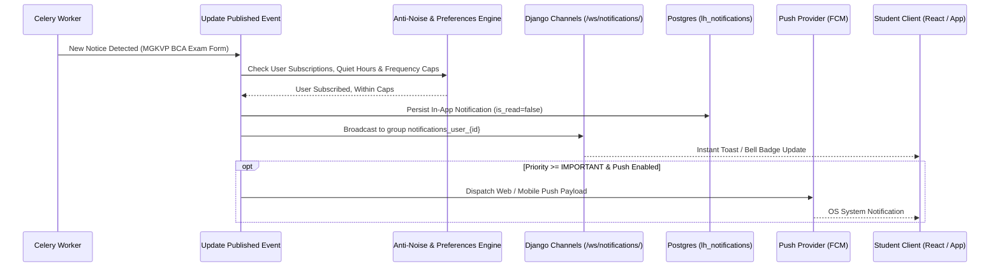

# LEARNINGHUB STUDENT UPDATES HUB — NOTIFICATION SPECIFICATION (V1.0)

> **Purpose:** User-Centric, Spam-Free Notification Architecture  
> **Channels:** In-App (Real-Time WebSocket), Push (FCM / Web Push), Email, Opt-In SMS/WhatsApp  

---

## 1. NOTIFICATION PRIORITY TAXONOMY

| Priority | Criteria & Examples | Delivery Channels | Quiet Hours Override? | Max Frequency |
|---|---|---|---|---|
| **LEVEL 1: CRITICAL** | • Exam tomorrow / Datesheet changed<br>• Exam form deadline expires in < 24 hours<br>• Semester Result declared officially | • In-App (Immediate)<br>• Push Notification<br>• Urgent Email<br>• WhatsApp/SMS (Opt-in) | **YES** (Overridden for genuine emergencies) | Max 2 per day |
| **LEVEL 2: IMPORTANT** | • Admit Card / Hall Ticket released<br>• Examination center list published<br>• New semester examination form opened<br>• Scholarship application deadline in 3 days | • In-App (Immediate)<br>• Push Notification<br>• Email | **NO** (Queued until 07:00 AM local time) | Max 3 per day |
| **LEVEL 3: NORMAL** | • Academic calendar announcement<br>• College holiday list<br>• General workshop, seminar, or internship opportunity | • In-App Notification Center<br>• Daily / Weekly Digest | **NO** (Never breaks quiet hours) | Batched into Digest |

---

## 2. CHANNELS & PROTOCOLS



### 2.1 In-App Real-Time WebSocket Delivery
- Integrated directly with LearningHub's canonical `NotificationConsumer` at `/ws/notifications/`.
- Payload format:
```json
{
  "type": "notification",
  "title": "MGKVP Exam Form Deadline Extension",
  "message": "BCA 2nd & 4th semester forms extended to Oct 15.",
  "data": {
    "update_id": "upd-b7f30a91",
    "category": "EXAMINATION",
    "importance": "IMPORTANT",
    "action_url": "/updates/upd-b7f30a91",
    "deadline": "2026-10-15T18:29:59Z"
  }
}
```

---

## 3. DEADLINE REMINDER ENGINE

When an update contains a verified deadline:
1. Student clicks **"Set Reminder"** on the update card.
2. System registers reminder triggers:
   - `T - 7 Days`: Early reminder to prepare documents.
   - `T - 3 Days`: Crucial reminder before servers get overloaded.
   - `T - 1 Day`: Urgent last-chance alert.
   - `T - 0 Day (Morning 08:00 AM)`: Same day deadline closing alert.
3. Reminders are managed by `apps.updates.tasks.check_scheduled_reminders` running every 15 minutes.
4. If an official notice extends the deadline (e.g. from Oct 10 to Oct 15), the system automatically updates pending reminders without duplicating notifications.

---

## 4. RESULT WATCHER & EXAM WATCHER

Students can activate automated watchers for their specific target:

```
[Result Watch: Activated]
University: MGKVP
Course: BCA
Semester: 3rd Semester
Trigger Condition: Official declaration on mgkvp.ac.in/Home/Results
```

- When the Ingestion Engine verifies that the result notice or link is published:
  - Generates instant `LEVEL 1: CRITICAL` alert.
  - Formats direct link to the official roll-number result submission page.
  - Never marks "Result Declared" unless verified by HTTP 200 and document match.

---

## 5. ANTI-NOISE & USER FREQUENCY CONTROLS

1. **Quiet Hours:** Default 10:00 PM to 07:00 AM local student time. Non-critical notifications are queued until the morning window.
2. **Notification Caps:** Maximum 3 push alerts in a 24-hour period across all non-critical categories.
3. **Digest Mode:**
   - Daily Digest option: aggregates normal updates into a single concise morning briefing:
     *"Good morning! 2 new exam notices and 1 scholarship deadline for MGKVP BCA."*
4. **Instant Opt-Out / Category Granularity:**
   - User settings allow granular toggles:
     - `Exam Form & Admit Cards` (On/Off)
     - `Results` (On/Off)
     - `Timetable Revisions` (On/Off)
     - `Scholarships` (On/Off)
     - `Competitive Exams` (On/Off)
