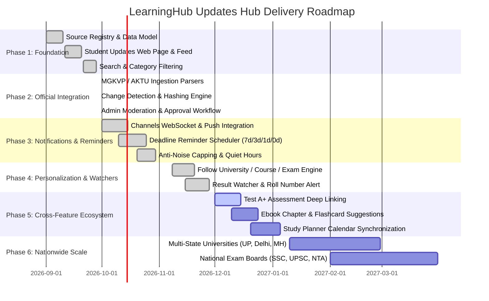

# LEARNINGHUB STUDENT UPDATES HUB — STRATEGIC ROADMAP

> **Product Vision:** The Definitive, Trusted Information Command Center for Higher Education & Competitive Aspirants  
> **Horizon:** 2026 – 2027  

---

## 1. PHASED IMPLEMENTATION TIMELINE

---

## 2. DETAILED PHASE GOALS

### Phase 1: Foundation (Delivered in V1.0)
- Core `apps.updates` Django models (`UpdateSource`, `StudentUpdate`, `UpdateBookmark`, `UpdateReminder`, `UpdateCrossLink`).
- Clean Architecture `services.py` and `selectors.py`.
- Modern, clean, responsive React page (`/updates`) with search, categories, and urgent alert tiers.
- Source transparency badges (Level 1 to Level 5).

### Phase 2: Official Indian Universities & State Bodies (SHIPPED & VERIFIED)
- ✅ Deep crawlers for MGKVP, AKTU, University of Lucknow, University of Allahabad, and BHU.
- ✅ SSRF-safe `SourceCrawler` with per-domain timeout and polite rate-limiting.
- ✅ SHA-256 change detection engine with automatic diff generation and `UpdateVersion` tracking.
- ✅ Admin Moderation & Approval Workflow: Bulk actions (`approve_and_publish`, `mark_as_urgent`, `reject_and_flag`), Django admin triggers, and REST API moderation endpoint (`/api/v1/updates/<id>/moderate/`).
- ✅ 100% test coverage with 30 passing pytest suites.

### Phase 3: Multi-Channel Notifications & Anti-Noise Engine (SHIPPED & VERIFIED)
- ✅ Real-time in-app WebSocket toasts via Django Channels (`NotificationConsumer`) and notification center badge count sync.
- ✅ Multi-tier Anti-Noise engine with Quiet Hours enforcement (10:00 PM – 07:00 AM) and emergency override for `URGENT` circulars.
- ✅ Rolling daily push frequency capping (`max_daily_push`) and category-based granular opt-ins.
- ✅ Deferred delivery buffer with `QueuedUpdateNotification` and automated morning release scheduler (`release_queued_notifications`).
- ✅ End-to-end delivery audit trail with `UpdateNotificationAudit` telemetry.
- ✅ Full REST API suite (`/api/v1/updates/preferences/`, `/notifications/queued/`, `/notifications/audits/`, `/broadcast/`).

### Phase 4: Personalization & Result Watchers (SHIPPED & VERIFIED)
- ✅ 1-click Follow / Unfollow engine for Universities, Courses, and Statutory Boards (`UpdateSubscription`).
- ✅ Dedicated "For You" personalized feed dynamically scoped to student's subscriptions with one-click follow suggestions.
- ✅ 24/7 Automated Result Watcher (`ResultWatcher` model & REST endpoints `/api/v1/updates/result-watchers/`).
- ✅ Live Radar scanning with roll number binding and automated gazette matching algorithm (`match_and_notify_result_watchers`).
- ✅ Front-end UI: Dedicated `ResultWatcherModal`, Result Watchers tab with real-time status pills, active count badges, and direct official scorecard linkouts.
- ✅ 100% verified test coverage: 43 Django pytest tests + 61 Vitest unit tests passing.

### Phase 5: LearningHub Cross-Feature Unification
- Automatic mapping of notice topics to **Test A+** assessment tests, **Ebook** chapters, and **Courses**.
- "Prepare Now" contextual action button on exam notices.
- Direct sync of examination dates and submission deadlines into **Study Planner** and calendar export (iCal / Google Calendar).

### Phase 6: National Scale & College Notice Dashboards
- Ingestion of statutory exam bodies: SSC, UPSC, NTA (JEE/NEET/CUET), IBPS, State PSCs.
- Verified College Notice Dashboards allowing college principals and HODs to post authenticated departmental circulars.
- Anonymized analytics on notice read rates and student engagement.
