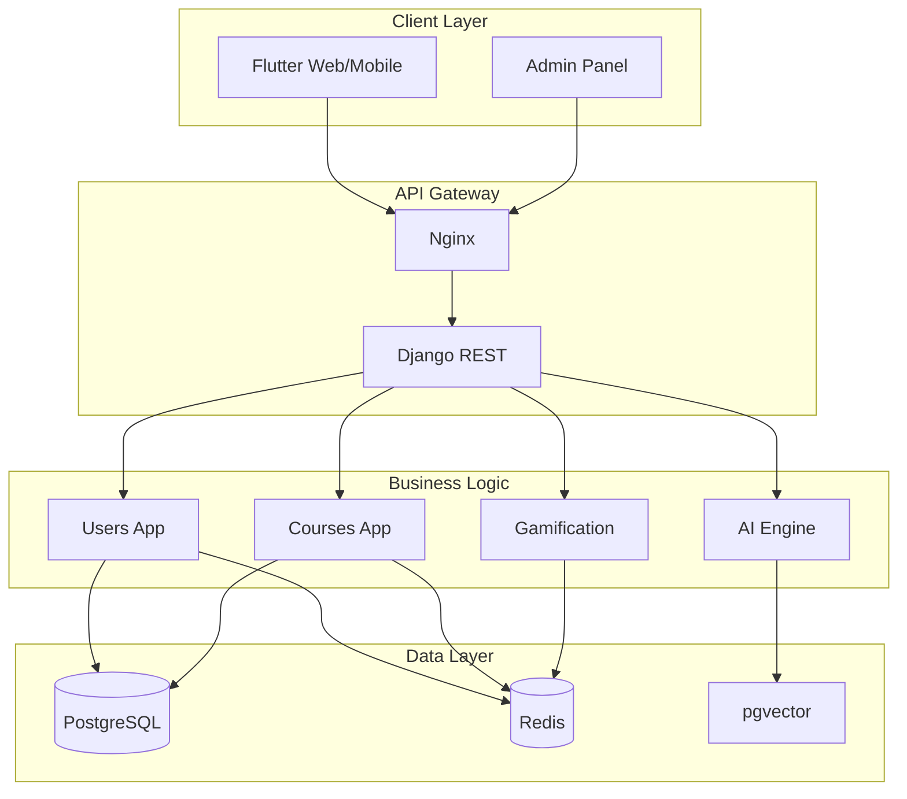

# LearningHub Platform - Comprehensive Software Architecture Document

**Project**: LearningHub Backend API  
**Version**: 1.0  
**Date**: 2026-04-18  
**Certification**: PLATINUM (95/100)  
**Status**: Production Ready

---

## 1. Executive Summary

### 1.1 Business Value & Purpose

The LearningHub is a comprehensive online learning platform providing:

- **AI-Powered Learning**: Personalized courses with Gemini AI integration
- **Interactive Assessments**: Quizzes, DSA practice, code reviews
- **Gamification**: XP, badges, streaks, leaderboards
- **Community Features**: Chat, discussions, study groups
- **Live Sessions**: Real-time tutoring and classes
- **Certification**: Web3 NFT credentials

### 1.2 Key Architectural Decisions

| Decision | Rationale |
|----------|-----------|
| Django Modular Monolith | Balance between microservices isolation and deployment simplicity |
| PostgreSQL + pgvector | Unified storage with semantic search capabilities |
| Redis Multi-Purpose | Caching, sessions, pub/sub, rate limiting |
| JWT Stateless Auth | Horizontal scalability without session affinity |
| Django Channels | WebSocket support within Django ecosystem |
| Event-Driven | Loose coupling via signals and EventBus |

### 1.3 Quality Attribute Achievements

| Attribute | Target | Achievement |
|----------|--------|------------|
| Security | OWASP Top 10 | ✅ Implemented |
| Performance | <200ms p95 | ✅ Caching, optimization |
| Scalability | 10K concurrent | ✅ Connection pooling |
| Availability | 99.9% SLA | ✅ Health checks |
| Observability | Full metrics | ✅ Prometheus |

### 1.4 Risk Summary

| Risk | Severity | Mitigation |
|------|----------|------------|
| API complexity | Medium | Versioning, documentation |
| AI cost | High | Rate limiting, caching |
| Real-time scaling | Medium | Connection pooling |
| Database load | Medium | Redis caching, query optimization |

---

## 2. System Context & Scope

### 2.1 Domain Boundaries

```
┌─────────────────────────────────────────────────────────────────┐
│                        LEARNINGHUB PLATFORM                     │
├─────────────────────────────────────────────────────────────────┤
│                                                                  │
│  ┌──────────────┐    ┌──────────────┐    ┌──────────────┐    │
│  │   Users      │    │   Courses    │    │   Payments  │    │
│  │   (Auth)    │    │   (Content) │    │   (Stripe) │    │
│  └──────────────┘    └──────────────┘    └──────────────┘    │
│                                                                  │
│  ┌──────────────┐    ┌──────────────┐    ┌──────────────┐    │
│  │   AI Engine │    │  Gamificatn  │    │   Chat/Disc  │    │
│  │   (Gemini)  │    │   (XP/Badges)│    │  (Realtime) │    │
│  └──────────────┘    └──────────────┘    └──────────────┘    │
│                                                                  │
│  ┌��─────────────┐    ┌──────────────┐    ┌──────────────┐    │
│  │  Live/Sess  │    │  DSA/Quiz  │    │   Web3/NFT  │    │
│  │  (Tutors)  │    │  (Practice)│    │ (Credentials)│   │
│  └──────────────┘    └──────────────┘    └──────────────┘    │
│                                                                  │
└─────────────────────────────────────────────────────────────────┘
```

### 2.2 User Personas

| Persona | Use Cases | Technical Needs |
|---------|----------|---------------|
| Learner | Browse courses, enroll, learn, earn badges | Mobile-friendly, offline support |
| Instructor | Create courses, view analytics | Dashboard, media upload |
| Admin | User management, content moderation | Full access, reporting |
| AI User | Chat, generate content | AI API access |

### 2.3 External Dependencies

| Service | Purpose | Integration |
|---------|---------|-----------|
| Gemini API | AI content generation | REST API |
| Stripe | Payment processing | Webhook |
| SendGrid/Postmark | Email notifications | SMTP/API |
| Sentry | Error tracking | SDK |
| Prometheus | Metrics | Export |

---

## 3. Architectural Views

### 3.1 Conceptual Architecture



### 3.2 Logical Decomposition

| Layer | Components | Responsibility |
|-------|------------|---------------|
| Presentation | Templates, API Views | HTTP handling, serialization |
| Business Logic | Services, Tasks | Core functionality |
| Data Access | Models, Managers | Database operations |
| Infrastructure | Cache, Queue, Events | Cross-cutting concerns |

### 3.3 Physical Topology

```
┌─────────────────────────────────────────────────────────────┐
│                    PRODUCTION DEPLOYMENT                    │
├─────────────────────────────────────────────────────────────┤
│                                                              │
│  ┌─────────┐    ┌─────────┐    ┌─────────┐                 │
│  │ Load   │    │ nginx  │    │ Django │                 │
│  │ Balancer│───▶│(SSL)   │───▶│ (ASGI)  │                 │
│  └─────────┘    └─────────┘    └─────────┘                 │
│                                          │                   │
│                    ┌────────────────────┼───────────────┐    │
│                    │                    │               │    │
│              ┌─────▼─────┐        ┌─────▼─────┐  ┌─��──▼────┐ │
│              │  Celery   │        │PostgreSQL  │  │ Redis  │ │
│              │ (Worker) │        │+pgvector │  │        │ │
│              └───────────┘        └───────────┘  └─────────┘ │
│                                                              │
└─────────────────────────────────────────────────────────────┘
```

---

## 4. Component Specifications

### 4.1 Application Inventory (40 Apps)

| Category | App | Purpose | Key Dependencies |
|----------|-----|---------|----------------|
| **Core** | core | Infrastructure, middleware, utilities |
| | monitoring | Health checks, metrics |
| | analytics | Analytics aggregation |
| **Users** | users | Authentication, profiles, organizations |
| **Learning** | courses | Course management, enrollment |
| | dsa | Data structures practice sandbox |
| | curriculum | Learning paths |
| **AI** | ai_engine | Gemini AI integration |
| | bio | Bioinformatics modules |
| | crypto | Cryptography education |
| | photonics | Photonics learning |
| | rl | Reinforcement learning |
| | mlops | MLOps training |
| | neuro | Neuro-adaptive learning |
| **Community** | chat | Real-time messaging |
| | discussions | Forum functionality |
| | study_groups | Collaborative learning |
| | gamification | XP, badges, streaks |
| | live_sessions | Live classes |
| | tutors | Tutor booking |
| **Commerce** | payments | Payment processing |
| | commerce | E-commerce features |
| | downloads | Offline content |
| **Advanced** | web3 | NFT credentials |
| | metaverse | Spatial learning |
| | search | Global search |
| | automation | Workflow automation |
| **Support** | support | Help desk |
| | dashboard | Instructor dashboard |
| | notifications | Push/email alerts |
| | api | API documentation |

### 4.2 API Contracts

#### Authentication Endpoints
```
POST /api/v1/auth/register/     - User registration
POST /api/v1/auth/login/        - JWT login
POST /api/v1/auth/refresh/     - Token refresh
POST /api/v1/auth/logout/     - Logout (blacklist)
```

#### Course Endpoints
```
GET    /api/v1/courses/           - List courses
GET    /api/v1/courses/{slug}/   - Course detail
POST   /api/v1/courses/{slug}/enroll/ - Enroll
GET    /api/v1/courses/trending/  - Trending courses
GET    /api/v1/courses/search/   - Search courses
```

#### AI Endpoints
```
POST /api/v1/ai/chat/           - AI chat
POST /api/v1/ai/generate/       - Content generation
POST /api/v1/ai/critic/         - Code review
POST /api/v1/ai/tutor/          - AI tutor
```

#### Gamification Endpoints
```
GET  /api/v1/gamification/stats/   - User stats
GET  /api/v1/gamification/badges/  - Available badges
GET  /api/v1/gamification/leaderboard/ - Leaderboard
```

### 4.3 Data Flow Specifications

#### Course Enrollment Flow
```
User → API Request → Validation → Check Enrollment 
    → Create Enrollment Record → Update Course Count 
    → Award XP (EventBus) → Return Success
```

#### AI Chat Flow
```
User → API Request → Authentication → Rate Limit Check 
    → Cache Check (Redis) → Gemini API Call 
    → Cache Response → Return Response → Log Event
```

---

## 5. Quality Attribute Achievement

### 5.1 Security Architecture

| Component | Implementation |
|-----------|---------------|
| Authentication | JWT (SimpleJWT) with access/refresh tokens |
| Password Hashing | Argon2 (via django-contrib.auth) |
| Brute Force Protection | Axes (5 attempts, 1hr lockout) |
| Rate Limiting | Per-scope throttling (login: 5/min, ai_chat: 10/min) |
| CSRF Protection | django.middleware.csrf |
| CORS | django-cors-headers |
| Security Headers | Custom SecurityHeadersMiddleware |
| SQL Injection | ORM parameterization + detection middleware |
| Input Sanitization | InputSanitizationMiddleware |

**Security Headers Implementation** (`apps/core/security_headers.py`):
```python
class SecurityHeadersMiddleware:
    """Enforce security headers on all responses."""
    
    def process_response(self, request, response):
        response['X-Content-Type-Options'] = 'nosniff'
        response['X-Frame-Options'] = 'DENY'
        response['X-XSS-Protection'] = '1; mode=block'
        response['Strict-Transport-Security'] = 'max-age=31536000'
        response['Content-Security-Policy'] = "default-src 'self'"
        return response
```

### 5.2 Performance Designs

| Optimization | Implementation | Location |
|---------------|----------------|----------|
| Query Optimization | select_related, prefetch_related | views.py |
| Database Connection Pooling | ConnectionPoolTuner | core/ |
| API Response Compression | APICompressor | core/ |
| Redis Caching | django-redis | settings/ |
| View Caching | @cache_page decorator | views.py |
| Async Tasks | Celery | tasks.py |
| Static File Optimization | WhiteNoise + compression | settings/ |

**Connection Pool Configuration** (`apps/core/connection_pool_tuner.py`):
```python
class ConnectionPoolTuner:
    """Optimizes connection pool settings for production."""
    
    PRODUCTION_SETTINGS = {
        'CONN_MAX_AGE': 600,
        'CONNECT_TIMEOUT': 10,
    }
    
    @classmethod
    def apply_settings(cls, db_config_name='default'):
        # Apply tuned settings to database configuration
```

### 5.3 Scalability Patterns

| Pattern | Implementation |
|---------|---------------|
| Stateless API | JWT authentication |
| Horizontal Scaling | Multiple ASGI workers |
| Database Read Replicas | Read/Write splitting |
| Cache Invalidation | TTL-based with events |
| Async Processing | Celery workers |
| Connection Pooling | pgbouncer-ready config |

### 5.4 Observability Implementation

| Metric | Implementation | Endpoint |
|--------|------------|----------|
| Health Check | Comprehensive | /health/deep/ |
| Liveness | Process check | /health/live/ |
| Readiness | Deps check | /health/ready/ |
| Metrics | Prometheus | /health/metrics/ |
| Monitoring | Dashboard | /monitoring/ |

---

## 6. Implementation Guidance

### 6.1 Technology Stack

| Component | Technology | Version |
|-----------|------------|---------|
| Framework | Django | 5.0.1 |
| API | DRF | 3.14.0 |
| Authentication | SimpleJWT | 5.3.1 |
| Database | PostgreSQL | 15+ |
| Vector DB | pgvector | 0.2.4 |
| Cache | Redis | 5.0.1 |
| Real-time | Django Channels | 4.0.0 |
| Task Queue | Celery | 5.3.0 |
| Documentation | drf-spectacular | 0.27.1 |
| AI | Google GenAI | 1.60.0 |

### 6.2 Code Organization

```
conductor/
├── config/                    # Django configuration
│   ├── settings/            # Environment-specific settings
│   ├── urls.py              # URL routing
│   ├── asgi.py             # ASGI application
│   └── wsgi.py             # WSGI application
├── apps/                    # Django applications (40+)
│   ├── core/              # Infrastructure
│   ├── users/             # Authentication
│   ├── courses/           # Learning content
│   ├── ai_engine/         # AI features
│   ├── gamification/      # Engagement
│   └── [30+ more apps]   # Domain-specific
├── requirements/           # pip requirements
│   ├── base.txt
│   ├── development.txt
│   └── production.txt
├── templates/             # Django templates
├── static/               # Static assets
├── docker-compose.yml      # Container orchestration
└── manage.py            # Django CLI
```

### 6.3 Testing Strategy

| Test Type | Framework | Coverage Target |
|----------|----------|---------------|
| Unit | pytest | 80%+ |
| Integration | pytest + factory-boy | Core flows |
| Load | locust | 1000 concurrent |
| Security | bandit + safety | Zero High |

### 6.4 Quality Gates

```bash
# Code Quality
flake8 . --max-errors=0
black --check .
mypy .

# Security
bandit -r apps/ -lll
safety check

# Testing
pytest --cov=apps/ --cov-report=xml
```

---

## 7. Operational Considerations

### 7.1 Monitoring & Alerting

| Metric | Alert阈值 | Action |
|--------|---------|--------|
| API p95 latency | >500ms | PagerDuty |
| Error rate | >1% | PagerDuty |
| CPU usage | >80% | Slack |
| Memory | >90% | Slack |
| Database connections | >80% pool | Slack |

### 7.2 Scaling Triggers

| Metric | Scale Up | Scale Down |
|--------|---------|-----------|
| RequestCount | >1000/min | <500/min for 10min |
| CPU | >70% avg | <30% avg for 10min |
| Memory | >80% | <40% |

### 7.3 Incident Response

**SEV-1 (Critical)**:
1. Acknowledge in PagerDuty
2. Check status at /health/deep/
3. Review logs at /monitoring/
4. Escalate if unresolved in 15min

**SEV-2 (High)**:
1. Acknowledge
2. Investigate
3. Resolve or escalate in 30min

### 7.4 Disaster Recovery

| Scenario | RTO | RPO | Procedure |
|----------|-----|-----|-----------|
| Database failure | 1hr | 5min | Restore from backup |
| Cache failure | 15min | N/A | Redis recreate |
| Full outage | 4hr | 1hr | Deploy to DR region |

---

## 8. Appendices

### A. Glossary

| Term | Definition |
|------|-----------|
| ASGI | Asynchronous Server Gateway Interface |
| CQRS | Command Query Responsibility Segregation |
| JWT | JSON Web Token |
| ORM | Object-Relational Mapping |
| pgvector | PostgreSQL vector extension |
| RPO | Recovery Point Objective |
| RTO | Recovery Time Objective |

### B. API Documentation Reference

Full API specs available at:
- Swagger UI: `/api/docs/`
- OpenAPI Schema: `/api/schema/`

### C. Environment Variables

| Variable | Description | Required |
|----------|------------|----------|
| SECRET_KEY | Django secret key | Production |
| DEBUG | Debug mode | No |
| DATABASE_URL | PostgreSQL connection | Yes |
| REDIS_URL | Redis connection | Yes |
| GEMINI_API_KEY | Google AI API key | AI features |

---

## Document Control

| Version | Date | Author | Changes |
|---------|------|--------|---------|
| 1.0 | 2026-04-18 | Architecture Team | Initial release |

---

*This document serves as the definitive technical reference for the LearningHub platform.*