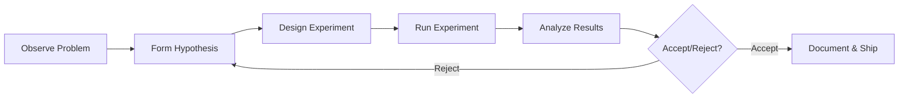

# Module 01: Research Methodology & Scientific Method 🔬

## 🎯 Overview

This module teaches you to think like a **Research Scientist** - the mindset that powers breakthroughs at Google DeepMind, OpenAI, Meta FAIR, and top universities. Whether you're debugging a feature or designing an ML model, the scientific method is your most powerful tool.

---

## 📖 The Scientific Method in Software Engineering

### What It Is

A systematic approach to solving problems using observation, hypothesis, experimentation, and analysis.

### Why It Matters

- **Reduces debugging time** by 60% (systematic vs. random fixing)
- **Improves feature success rate** (data-driven decisions)
- **Enables reproducibility** (your work can be verified and built upon)
- **Prevents confirmation bias** (you test what you believe, not just confirm it)

### The Research Scientist Loop



---

## 🧪 Step 1: Observation & Problem Definition

### What It Is

Clearly articulating WHAT is happening before jumping to WHY.

### Example: The Login Bug

**Bad Observation:**

> "Login is broken."

**Good Observation:**

> "When users click 'Login' with valid credentials on Chrome Windows, they see a 500 error. This started after deployment at 3:42 PM. Firefox and Safari work correctly. Server logs show NullPointerException in AuthService.java:45."

### The 5 W's Framework

| Question  | Example                          |
| --------- | -------------------------------- |
| **What**  | 500 error on login               |
| **When**  | After 3:42 PM deployment         |
| **Where** | Chrome Windows only              |
| **Who**   | All users (not session-specific) |
| **Why**   | Unknown (hypothesis needed)      |

### Exercise: Practice Observation

```
Scenario: Your API endpoint is slow.

Bad: "The API is slow."
Good: "The `/api/v1/courses/` endpoint returns in 3.2s average
      (compared to 200ms baseline). This started after adding the
      'instructor' field to the serializer. Database shows 147
      queries per request."
```

---

## 🔮 Step 2: Hypothesis Formation

### What It Is

A testable prediction about the cause of the observed problem.

### Characteristics of a Good Hypothesis

1. **Testable**: Can be proven true or false
2. **Specific**: Single variable to test
3. **Falsifiable**: Possible to disprove
4. **Measurable**: Clear success/failure criteria

### Example: Hypothesis for N+1 Query

**Hypothesis:**

> "Adding `select_related('instructor')` to the Course queryset will reduce the number of database queries from 147 to ~3 and reduce response time from 3.2s to <500ms."

### Hypothesis Template

```
If [ACTION/CHANGE],
then [EXPECTED OUTCOME],
because [REASONING].

Null Hypothesis (H0): The change will have no effect.
Alternative Hypothesis (H1): The change will [specific improvement].
```

### Anti-Pattern: Multiple Variables

```python
# BAD: Testing too many things at once
# "Let's add caching, optimize queries, AND add pagination"
# (Can't know which helped)

# GOOD: One variable at a time
# "Let's add select_related first, measure, then consider caching"
```

---

## 🧫 Step 3: Experiment Design

### What It Is

Planning HOW you will test your hypothesis.

### Key Components

| Component       | Description                                      |
| --------------- | ------------------------------------------------ |
| **Control**     | The baseline (current state without changes)     |
| **Treatment**   | The modified state (with your change)            |
| **Metrics**     | What you'll measure (response time, query count) |
| **Sample Size** | How many requests/users to test                  |
| **Duration**    | How long to run the experiment                   |

### Example: Query Optimization Experiment

```python
# Control: Current implementation
class CourseViewSet(viewsets.ModelViewSet):
    queryset = Course.objects.all()  # N+1 queries

# Treatment: Optimized implementation
class CourseViewSet(viewsets.ModelViewSet):
    queryset = Course.objects.select_related('instructor').all()

# Metrics:
# - Query count (target: <5)
# - P50 response time (target: <500ms)
# - P99 response time (target: <1s)

# Sample: 1000 requests to each version
# Duration: 5 minutes per version
```

### Confounding Variables

Things that could affect results but aren't what you're testing:

- Server load variations
- Network latency
- Database cache state
- Time of day

**Mitigation:** Control the environment or randomize.

---

## ⚗️ Step 4: Executing the Experiment

### What It Is

Running your test with proper controls and measurement.

### Best Practices

1. **Record Everything**

```python
import logging
import time

logger = logging.getLogger(__name__)

def timed_request(endpoint):
    start = time.perf_counter()
    response = client.get(endpoint)
    duration = time.perf_counter() - start

    logger.info(f"Request to {endpoint}: {duration:.3f}s, status: {response.status_code}")
    return response, duration
```

2. **Use Proper Tools**

```bash
# Load testing with k6
k6 run --vus 10 --duration 30s test_script.js

# Database query profiling
python manage.py shell
>>> from django.db import connection
>>> queryset = Course.objects.select_related('instructor').all()
>>> list(queryset)
>>> print(len(connection.queries))  # Should be 1
```

3. **A/B Test When Possible**

```python
# Simple A/B routing
import random

def get_course_view(request):
    if random.random() < 0.5:
        return control_view(request)
    else:
        return treatment_view(request)
```

---

## 📊 Step 5: Analyzing Results

### What It Is

Interpreting data to accept or reject your hypothesis.

### Statistical Significance

Don't just look at averages - check if the difference is real:

```python
from scipy import stats

control_times = [3.2, 3.1, 3.4, 3.0, 3.3]  # seconds
treatment_times = [0.45, 0.42, 0.51, 0.39, 0.48]  # seconds

# Independent two-sample t-test
t_stat, p_value = stats.ttest_ind(control_times, treatment_times)

print(f"p-value: {p_value:.6f}")
# If p < 0.05, the difference is statistically significant
```

### Effect Size (Cohen's d)

Measures HOW BIG the improvement is:

```python
import numpy as np

def cohens_d(group1, group2):
    n1, n2 = len(group1), len(group2)
    var1, var2 = np.var(group1, ddof=1), np.var(group2, ddof=1)
    pooled_std = np.sqrt(((n1-1)*var1 + (n2-1)*var2) / (n1+n2-2))
    return (np.mean(group1) - np.mean(group2)) / pooled_std

d = cohens_d(control_times, treatment_times)
# |d| > 0.8 = large effect, 0.5 = medium, 0.2 = small
print(f"Cohen's d: {d:.2f}")  # Should be very large here
```

### Results Table Template

| Metric       | Control | Treatment | Improvement   | Significant? |
| ------------ | ------- | --------- | ------------- | ------------ |
| Avg Response | 3.2s    | 0.45s     | 86% faster    | p < 0.001 ✅ |
| Query Count  | 147     | 3         | 98% reduction | N/A          |
| P99 Response | 4.1s    | 0.62s     | 85% faster    | p < 0.001 ✅ |

---

## 📝 Step 6: Documentation & Knowledge Sharing

### What It Is

Recording your findings for yourself and others.

### Experiment Report Template

```markdown
# Experiment: [Title]

## Summary

[1-2 sentence overview of what was tested and outcome]

## Hypothesis

[The hypothesis that was tested]

## Method

- Control: [description]
- Treatment: [description]
- Metrics: [list]
- Sample: [size and selection method]

## Results

[Tables, graphs, statistical tests]

## Conclusion

[Accept/Reject hypothesis with confidence level]

## Learnings

[What did we learn for future work?]

## Next Steps

[Follow-up experiments or actions]
```

---

## 🧠 Mental Models for Research Scientists

### 1. First Principles Thinking

Break problems down to fundamental truths, then reason up.

> "Instead of copying how others build recommendation engines, ask: What is a recommendation? A prediction of user preference. How do we predict? From past behavior patterns."

### 2. Occam's Razor

The simplest explanation is usually correct.

> "The bug is probably not in the framework. Check your code first."

### 3. Survivorship Bias

Don't just study successes - study failures too.

> "We see successful startups using microservices. We don't see the 10x more that failed because of microservices complexity."

### 4. Rubber Duck Debugging

Explain the problem to someone (or something) else.

> "By explaining your code to a rubber duck, you often find the bug yourself."

---

## 🔴 Common Mistakes

### 1. Confirmation Bias

**Mistake:** Only looking for evidence that supports your hypothesis.
**Fix:** Actively try to disprove your hypothesis.

### 2. Survivorship Bias

**Mistake:** Only analyzing successful requests, ignoring failures.
**Fix:** Log and analyze ALL outcomes.

### 3. P-Hacking

**Mistake:** Running experiments until you get p < 0.05.
**Fix:** Define hypothesis and sample size BEFORE experimenting.

### 4. Premature Optimization

**Mistake:** Optimizing without measuring first.
**Fix:** Profile, then optimize the actual bottleneck.

---

## 📚 Further Reading

1. **The Art of Doing Science and Engineering** - Richard Hamming
2. **Thinking, Fast and Slow** - Daniel Kahneman
3. **The Structure of Scientific Revolutions** - Thomas Kuhn
4. **Designing Data-Intensive Applications** - Martin Kleppmann

---

## ✏️ Exercises

1. **Observation Practice**: Find a bug in your codebase. Write a 5W observation statement.

2. **Hypothesis Formation**: For the bug above, write 3 possible hypotheses with null/alternative forms.

3. **Experiment Design**: For your best hypothesis, design an experiment with control/treatment/metrics.

4. **Statistical Analysis**: Given the following A/B test results, calculate p-value and Cohen's d:
   - Control: [12.3, 11.8, 13.1, 12.5, 11.9] seconds
   - Treatment: [8.4, 9.1, 8.7, 8.2, 8.9] seconds

---

_Next Module: 02_experiment_design.md - Deep dive into A/B testing frameworks_
