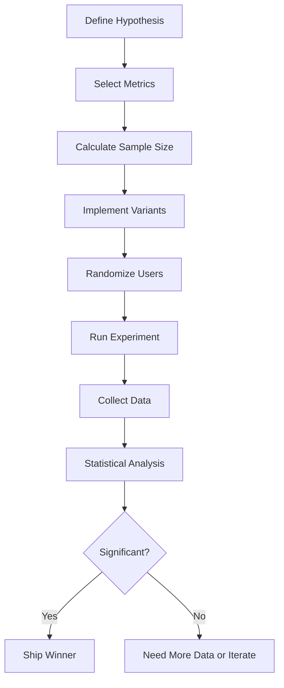

# Module 02: Experiment Design & A/B Testing 🧪

## 🎯 Overview

This module teaches you to design and run **controlled experiments** like a Research Scientist at Google, Netflix, or Amazon. A/B testing powers billions of dollars in optimization decisions. Learn to do it right.

---

## 📖 What is A/B Testing?

### Definition

A **randomized controlled experiment** where users are split into groups, each experiencing a different version of a product. We measure which version performs better on key metrics.

### Why It Matters

- **Amazon**: Every product page element was A/B tested
- **Netflix**: Personalized thumbnails increased engagement 20%+
- **Google**: Tests 50,000+ experiments per year
- **Booking.com**: Runs 1000+ concurrent experiments

### The Core Question

> "Is this change actually better, or did we just get lucky?"

---

## 🏗️ Anatomy of an A/B Test



---

## 📐 Step 1: Hypothesis & Metrics

### Primary Metric (North Star)

The ONE metric you're optimizing for.

**Examples:**

- E-commerce: Revenue per visitor
- Learning app: Course completion rate
- Social app: Daily active users
- SaaS: Trial-to-paid conversion

### Guardrail Metrics

Metrics that must NOT degrade.

**Examples:**

- Page load time (user experience)
- Error rate (reliability)
- Customer support tickets (hidden issues)
- User retention (long-term health)

### Example Hypothesis

```markdown
## A/B Test: Gamification Badge Display

**Hypothesis**: Showing the user's badge progress on the course
page will increase lesson completion rate.

**Primary Metric**: Lesson completion rate

- Control baseline: 42%
- Target improvement: 5% relative (to 44.1%)

**Guardrail Metrics**:

- Page load time: Must stay < 2s
- Drop-off rate: Must not increase > 2%
- Support tickets: Must not increase > 10%

**Minimum Detectable Effect**: 5% relative
```

---

## 📊 Step 2: Sample Size Calculation

### Why Calculate Sample Size?

- **Too small**: You'll miss real effects (false negatives)
- **Too large**: Waste of time and resources
- **Just right**: Detect true effects with confidence

### The Math (Simplified)

For a two-sample proportion test:

```python
from scipy.stats import norm
import numpy as np

def sample_size_per_group(
    baseline_rate: float,      # Current conversion rate (e.g., 0.42)
    min_detectable_effect: float,  # e.g., 0.05 for 5% relative lift
    alpha: float = 0.05,       # Significance level
    power: float = 0.80        # Statistical power
) -> int:
    """Calculate required sample size per group."""

    p1 = baseline_rate
    p2 = baseline_rate * (1 + min_detectable_effect)

    pooled_p = (p1 + p2) / 2

    z_alpha = norm.ppf(1 - alpha / 2)  # ~1.96 for alpha=0.05
    z_beta = norm.ppf(power)            # ~0.84 for power=0.80

    n = (2 * pooled_p * (1 - pooled_p) * (z_alpha + z_beta)**2) / (p2 - p1)**2

    return int(np.ceil(n))

# Example
n = sample_size_per_group(
    baseline_rate=0.42,
    min_detectable_effect=0.05  # 5% relative improvement
)
print(f"Need {n} users per group")  # ~7,500 per group
```

### Quick Reference Table

| Baseline | MDE 5% | MDE 10% | MDE 20% |
| -------- | ------ | ------- | ------- |
| 5%       | 31,000 | 7,800   | 2,000   |
| 10%      | 15,000 | 3,800   | 960     |
| 30%      | 4,200  | 1,100   | 280     |
| 50%      | 3,200  | 800     | 200     |

_Sample size per group, α=0.05, power=0.80_

---

## 🎲 Step 3: Randomization

### Why Randomize?

To ensure groups are **comparable** and differences are due to the treatment, not pre-existing differences.

### Implementation

```python
import hashlib

def assign_variant(user_id: str, experiment_name: str, variants: list) -> str:
    """
    Deterministically assign a user to a variant.
    Same user always gets same variant (important for consistency).
    """
    hash_input = f"{experiment_name}:{user_id}"
    hash_value = int(hashlib.md5(hash_input.encode()).hexdigest(), 16)

    variant_index = hash_value % len(variants)
    return variants[variant_index]

# Usage
user_variant = assign_variant(
    user_id="user_12345",
    experiment_name="badge_display_v1",
    variants=["control", "treatment"]
)
print(f"User assigned to: {user_variant}")
```

### Stratified Randomization

When you need balanced groups across important segments:

```python
def stratified_assignment(user_id: str, user_segment: str, experiment: str):
    """
    Ensures balanced assignment within each segment.
    Useful when segments (e.g., new vs. returning users)
    might respond differently.
    """
    # Include segment in the hash
    hash_input = f"{experiment}:{user_segment}:{user_id}"
    hash_value = int(hashlib.md5(hash_input.encode()).hexdigest(), 16)
    return "treatment" if hash_value % 2 == 0 else "control"
```

---

## 📈 Step 4: Running the Experiment

### Duration Guidelines

```
Minimum Duration = max(
    days_to_reach_sample_size,
    7_days_for_weekly_cycles,
    14_days_if_low_traffic
)
```

### Common Pitfalls

| Pitfall                 | Problem                                         | Solution                                         |
| ----------------------- | ----------------------------------------------- | ------------------------------------------------ |
| **Peeking**             | Checking results early leads to false positives | Use sequential testing or wait for full duration |
| **Novelty Effect**      | Users interact more with new things initially   | Run for 2+ weeks to let effect stabilize         |
| **Day-of-Week Effects** | Saturday users differ from Monday users         | Always include full weeks                        |
| **External Events**     | Holidays, news, outages confound results        | Note external factors in analysis                |

### Experiment Logging

```python
from dataclasses import dataclass
from datetime import datetime
from typing import Optional
import json

@dataclass
class ExperimentEvent:
    user_id: str
    experiment_name: str
    variant: str
    event_type: str  # 'exposure', 'conversion', 'click', etc.
    timestamp: datetime
    metadata: Optional[dict] = None

    def to_json(self):
        return json.dumps({
            'user_id': self.user_id,
            'experiment': self.experiment_name,
            'variant': self.variant,
            'event': self.event_type,
            'timestamp': self.timestamp.isoformat(),
            'metadata': self.metadata
        })

# Log every exposure (when user sees the variant)
def log_exposure(user_id, experiment, variant):
    event = ExperimentEvent(
        user_id=user_id,
        experiment_name=experiment,
        variant=variant,
        event_type='exposure',
        timestamp=datetime.utcnow()
    )
    # Send to logging system (Kafka, BigQuery, etc.)
    analytics.track(event.to_json())

# Log conversion (when user completes target action)
def log_conversion(user_id, experiment, variant, lesson_id):
    event = ExperimentEvent(
        user_id=user_id,
        experiment_name=experiment,
        variant=variant,
        event_type='lesson_completed',
        timestamp=datetime.utcnow(),
        metadata={'lesson_id': lesson_id}
    )
    analytics.track(event.to_json())
```

---

## 📊 Step 5: Statistical Analysis

### Chi-Square Test for Proportions

When comparing conversion rates:

```python
from scipy.stats import chi2_contingency
import numpy as np

def analyze_ab_test(
    control_conversions: int,
    control_total: int,
    treatment_conversions: int,
    treatment_total: int
):
    """Analyze A/B test results for proportion metrics."""

    # Build contingency table
    #                 Converted   Not Converted
    # Control           a             b
    # Treatment         c             d

    table = np.array([
        [control_conversions, control_total - control_conversions],
        [treatment_conversions, treatment_total - treatment_conversions]
    ])

    chi2, p_value, dof, expected = chi2_contingency(table)

    # Calculate conversion rates
    control_rate = control_conversions / control_total
    treatment_rate = treatment_conversions / treatment_total

    # Calculate lift
    relative_lift = (treatment_rate - control_rate) / control_rate

    # Calculate 95% confidence interval for lift
    se = np.sqrt(
        treatment_rate * (1 - treatment_rate) / treatment_total +
        control_rate * (1 - control_rate) / control_total
    )
    ci_lower = (treatment_rate - control_rate) - 1.96 * se
    ci_upper = (treatment_rate - control_rate) + 1.96 * se

    return {
        'control_rate': control_rate,
        'treatment_rate': treatment_rate,
        'relative_lift': relative_lift,
        'absolute_lift': treatment_rate - control_rate,
        'p_value': p_value,
        'significant': p_value < 0.05,
        'ci_95': (ci_lower, ci_upper)
    }

# Example usage
results = analyze_ab_test(
    control_conversions=420,
    control_total=1000,
    treatment_conversions=462,
    treatment_total=1000
)

print(f"Control Rate: {results['control_rate']:.2%}")
print(f"Treatment Rate: {results['treatment_rate']:.2%}")
print(f"Relative Lift: {results['relative_lift']:.2%}")
print(f"P-value: {results['p_value']:.4f}")
print(f"Significant: {results['significant']}")
print(f"95% CI: [{results['ci_95'][0]:.2%}, {results['ci_95'][1]:.2%}]")
```

### T-Test for Continuous Metrics

When comparing means (e.g., revenue, time spent):

```python
from scipy.stats import ttest_ind, mannwhitneyu

def analyze_continuous_metric(control_values, treatment_values):
    """Analyze A/B test for continuous metrics."""

    # Standard t-test (assumes normal distribution)
    t_stat, p_value = ttest_ind(control_values, treatment_values)

    # Mann-Whitney U test (non-parametric, no normality assumption)
    u_stat, p_value_mw = mannwhitneyu(
        control_values,
        treatment_values,
        alternative='two-sided'
    )

    control_mean = np.mean(control_values)
    treatment_mean = np.mean(treatment_values)

    return {
        'control_mean': control_mean,
        'treatment_mean': treatment_mean,
        'absolute_diff': treatment_mean - control_mean,
        'relative_diff': (treatment_mean - control_mean) / control_mean,
        'p_value_ttest': p_value,
        'p_value_mannwhitney': p_value_mw,
        'significant': p_value < 0.05
    }
```

---

## 🎯 Advanced Topics

### Multi-Armed Bandits

When you can't afford to show the losing variant for long:

```python
import numpy as np

class ThompsonSampling:
    """
    Adaptive A/B test that shifts traffic to winning variant.
    Balances exploration (testing) and exploitation (winning).
    """

    def __init__(self, n_variants: int):
        # Beta distribution priors for each variant
        self.successes = np.ones(n_variants)  # Alpha
        self.failures = np.ones(n_variants)   # Beta

    def select_variant(self) -> int:
        """Select variant using Thompson Sampling."""
        samples = [
            np.random.beta(self.successes[i], self.failures[i])
            for i in range(len(self.successes))
        ]
        return int(np.argmax(samples))

    def update(self, variant: int, success: bool):
        """Update beliefs based on observed outcome."""
        if success:
            self.successes[variant] += 1
        else:
            self.failures[variant] += 1

# Usage
bandit = ThompsonSampling(n_variants=3)  # A, B, C

for _ in range(1000):
    variant = bandit.select_variant()
    # Show variant to user, observe outcome
    success = np.random.random() < [0.1, 0.15, 0.12][variant]
    bandit.update(variant, success)
```

### Bayesian A/B Testing

Get probability of one variant being better than another:

```python
def bayesian_ab_analysis(
    control_successes, control_total,
    treatment_successes, treatment_total,
    n_simulations=100000
):
    """
    Calculate probability that treatment is better than control.
    """
    # Sample from posterior distributions
    control_samples = np.random.beta(
        control_successes + 1,
        control_total - control_successes + 1,
        n_simulations
    )

    treatment_samples = np.random.beta(
        treatment_successes + 1,
        treatment_total - treatment_successes + 1,
        n_simulations
    )

    # Probability treatment is better
    prob_treatment_better = np.mean(treatment_samples > control_samples)

    # Expected lift
    lift_samples = (treatment_samples - control_samples) / control_samples
    expected_lift = np.mean(lift_samples)
    lift_ci = np.percentile(lift_samples, [2.5, 97.5])

    return {
        'prob_treatment_better': prob_treatment_better,
        'expected_lift': expected_lift,
        'lift_95_ci': lift_ci
    }

# Example
result = bayesian_ab_analysis(420, 1000, 462, 1000)
print(f"Probability treatment is better: {result['prob_treatment_better']:.1%}")
print(f"Expected lift: {result['expected_lift']:.1%}")
```

---

## 🔴 Common Mistakes

### 1. Stopping Early (Peeking Problem)

**Wrong:**

```python
# Check every day, stop when p < 0.05
if current_p_value < 0.05:
    declare_winner()  # WRONG! Inflates false positive rate to 30%+
```

**Right:**

```python
# Pre-commit to sample size and duration
if sample_size >= required_sample_size:
    final_analysis()
```

### 2. No Power Analysis

**Wrong:**

```python
# "Let's run it for a week and see"
duration = 7  # Arbitrary
```

**Right:**

```python
# Calculate required sample size FIRST
required_n = sample_size_per_group(baseline=0.1, mde=0.05)
duration = required_n / daily_traffic
```

### 3. Multiple Comparisons

**Wrong:**

```python
# Testing 20 metrics increases false positives dramatically
for metric in all_metrics:
    if p_value[metric] < 0.05:
        print(f"{metric} is significant!")  # Wrong!
```

**Right:**

```python
# Bonferroni correction
adjusted_alpha = 0.05 / len(all_metrics)
for metric in all_metrics:
    if p_value[metric] < adjusted_alpha:
        print(f"{metric} is significant")
```

### 4. Selection Bias

**Wrong:**

```python
# Only analyzing users who completed the flow
users = get_users_who_completed_checkout()  # Biased sample!
```

**Right:**

```python
# Analyze all exposed users (intent-to-treat)
users = get_all_exposed_users()
```

---

## 📋 A/B Test Checklist

### Before Launch

- [ ] Hypothesis documented with primary + guardrail metrics
- [ ] Sample size calculated
- [ ] Minimum experiment duration determined
- [ ] Randomization logic implemented and tested
- [ ] Logging in place for exposures and conversions
- [ ] Rollback plan ready

### During Experiment

- [ ] Monitor for bugs/crashes in treatment
- [ ] Check sample ratio mismatch (should be ~50/50)
- [ ] Watch guardrail metrics
- [ ] No early peeking at results

### After Experiment

- [ ] Reached required sample size
- [ ] Statistical analysis complete
- [ ] Results documented
- [ ] Decision made (ship/iterate/abandon)
- [ ] Learnings shared with team

---

## ✏️ Exercises

1. **Sample Size Calculation**: Your checkout page converts at 8%. You want to detect a 10% relative improvement. Calculate the required sample size.

2. **Result Analysis**: Control: 1250 conversions / 10000 users. Treatment: 1340 conversions / 10000 users. Is this significant? What's the lift and confidence interval?

3. **Experiment Design**: Design an A/B test for showing course reviews on the course detail page. Define hypothesis, metrics, sample size, and duration.

4. **Bayesian Analysis**: Implement the bayesian_ab_analysis function and run it on your own data. What probability threshold would you use to ship?

---

_Next Module: 03_ml_fundamentals.md - Machine Learning from first principles_
