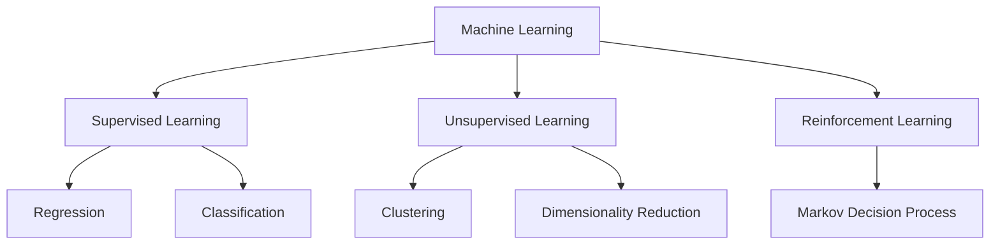

# Module 03: Machine Learning Fundamentals 🤖

## 🎯 Overview

This module teaches Machine Learning **from first principles** - the way research scientists at Google DeepMind and OpenAI think about it. No black boxes. You'll understand the math, the intuition, and the code.

---

## 📖 What is Machine Learning?

### Definition

Machine Learning is the science of programming computers to **learn patterns from data** instead of being explicitly programmed with rules.

### The Core Paradigm

```
Traditional Programming:  Rules + Data → Output
Machine Learning:         Data + Output → Rules (Model)
```

### Types of Machine Learning



---

## 🧮 Mathematical Foundations (Simplified)

### Linear Algebra: The Language of ML

**Vectors**: Lists of numbers representing features

```python
import numpy as np

# A user's features: [age, courses_completed, avg_score, days_active]
user = np.array([25, 12, 87.5, 45])
```

**Matrices**: Collections of vectors (datasets)

```python
# 3 users × 4 features
users = np.array([
    [25, 12, 87.5, 45],
    [32, 5, 72.0, 20],
    [19, 0, 0.0, 1]
])
```

**Dot Product**: Core operation in neural networks

```python
# weights: importance of each feature
weights = np.array([0.1, 0.3, 0.4, 0.2])

# prediction = weighted sum
prediction = np.dot(user, weights)
# = 25*0.1 + 12*0.3 + 87.5*0.4 + 45*0.2
# = 2.5 + 3.6 + 35.0 + 9.0 = 50.1
```

### Calculus: How Models Learn

**Gradient Descent**: Finding the minimum of a function by following the slope

```python
def gradient_descent(x_start, learning_rate, n_iterations):
    """
    Minimize f(x) = x² (minimum at x=0)
    Gradient: df/dx = 2x
    """
    x = x_start
    history = [x]

    for _ in range(n_iterations):
        gradient = 2 * x  # Derivative of x²
        x = x - learning_rate * gradient  # Update step
        history.append(x)

    return x, history

final_x, history = gradient_descent(x_start=10, learning_rate=0.1, n_iterations=50)
print(f"Converged to: {final_x:.6f}")  # Close to 0
```

### Probability: Quantifying Uncertainty

**Bayes' Theorem**: Update beliefs based on evidence

```
P(spam | words) = P(words | spam) × P(spam) / P(words)

Posterior = Likelihood × Prior / Evidence
```

```python
def naive_bayes_spam(email_words, spam_word_probs, ham_word_probs, prior_spam=0.3):
    """Simple spam classifier using Bayes' theorem."""

    log_prob_spam = np.log(prior_spam)
    log_prob_ham = np.log(1 - prior_spam)

    for word in email_words:
        if word in spam_word_probs:
            log_prob_spam += np.log(spam_word_probs[word])
        if word in ham_word_probs:
            log_prob_ham += np.log(ham_word_probs[word])

    # Convert back from log space
    return log_prob_spam > log_prob_ham
```

---

## 📈 Supervised Learning: Learning from Labels

### 1. Linear Regression

**What**: Predict a continuous value (price, score, time)

**How**: Find the best-fit line through the data

```python
class LinearRegression:
    """Linear Regression from scratch."""

    def __init__(self, learning_rate=0.01, n_iterations=1000):
        self.lr = learning_rate
        self.n_iter = n_iterations
        self.weights = None
        self.bias = None
        self.loss_history = []

    def fit(self, X, y):
        n_samples, n_features = X.shape

        # Initialize weights
        self.weights = np.zeros(n_features)
        self.bias = 0

        # Gradient descent
        for _ in range(self.n_iter):
            # Predict
            y_pred = np.dot(X, self.weights) + self.bias

            # Calculate loss (MSE)
            loss = np.mean((y_pred - y) ** 2)
            self.loss_history.append(loss)

            # Calculate gradients
            dw = (2 / n_samples) * np.dot(X.T, (y_pred - y))
            db = (2 / n_samples) * np.sum(y_pred - y)

            # Update weights
            self.weights -= self.lr * dw
            self.bias -= self.lr * db

    def predict(self, X):
        return np.dot(X, self.weights) + self.bias

# Example: Predict course completion time
X = np.array([[1, 10], [2, 20], [3, 30], [4, 40]])  # lessons, total_minutes
y = np.array([15, 28, 42, 55])  # completion days

model = LinearRegression(learning_rate=0.001, n_iterations=5000)
model.fit(X, y)
print(f"Weights: {model.weights}, Bias: {model.bias}")
```

### 2. Logistic Regression

**What**: Predict a probability/class (spam/not spam, churn/no churn)

**How**: Apply sigmoid function to linear output

```python
class LogisticRegression:
    """Binary classification from scratch."""

    def __init__(self, learning_rate=0.01, n_iterations=1000):
        self.lr = learning_rate
        self.n_iter = n_iterations
        self.weights = None
        self.bias = None

    def sigmoid(self, z):
        return 1 / (1 + np.exp(-np.clip(z, -500, 500)))

    def fit(self, X, y):
        n_samples, n_features = X.shape
        self.weights = np.zeros(n_features)
        self.bias = 0

        for _ in range(self.n_iter):
            # Forward pass
            linear = np.dot(X, self.weights) + self.bias
            y_pred = self.sigmoid(linear)

            # Gradients (derived from cross-entropy loss)
            dw = (1 / n_samples) * np.dot(X.T, (y_pred - y))
            db = (1 / n_samples) * np.sum(y_pred - y)

            # Update
            self.weights -= self.lr * dw
            self.bias -= self.lr * db

    def predict(self, X, threshold=0.5):
        linear = np.dot(X, self.weights) + self.bias
        probabilities = self.sigmoid(linear)
        return (probabilities >= threshold).astype(int)

    def predict_proba(self, X):
        linear = np.dot(X, self.weights) + self.bias
        return self.sigmoid(linear)
```

### 3. Decision Trees

**What**: Learn a tree of if-then-else rules

**Intuition**: Ask questions that best split the data

```python
class DecisionTreeNode:
    """A node in a decision tree (simplified)."""

    def __init__(self, feature_idx=None, threshold=None, left=None, right=None, value=None):
        self.feature_idx = feature_idx  # Which feature to split on
        self.threshold = threshold      # Split threshold
        self.left = left               # Left child (feature < threshold)
        self.right = right             # Right child (feature >= threshold)
        self.value = value             # Leaf node prediction

def gini_impurity(y):
    """Calculate Gini impurity for a set of labels."""
    if len(y) == 0:
        return 0

    proportions = np.bincount(y) / len(y)
    return 1 - np.sum(proportions ** 2)

def information_gain(y, y_left, y_right):
    """Calculate information gain from a split."""
    p = len(y_left) / len(y)
    return gini_impurity(y) - p * gini_impurity(y_left) - (1 - p) * gini_impurity(y_right)

# The full decision tree implementation is more complex,
# but this shows the core concepts
```

---

## 🔍 Unsupervised Learning: Finding Hidden Patterns

### 1. K-Means Clustering

**What**: Group data into K clusters without labels

**How**: Iteratively assign points and update centroids

```python
class KMeans:
    """K-Means clustering from scratch."""

    def __init__(self, n_clusters=3, max_iters=100):
        self.k = n_clusters
        self.max_iters = max_iters
        self.centroids = None

    def fit(self, X):
        n_samples = X.shape[0]

        # Random initialization
        random_idx = np.random.choice(n_samples, self.k, replace=False)
        self.centroids = X[random_idx]

        for _ in range(self.max_iters):
            # Assign clusters
            distances = self._compute_distances(X)
            labels = np.argmin(distances, axis=1)

            # Update centroids
            new_centroids = np.array([
                X[labels == i].mean(axis=0) if np.sum(labels == i) > 0
                else self.centroids[i]
                for i in range(self.k)
            ])

            # Check convergence
            if np.allclose(self.centroids, new_centroids):
                break

            self.centroids = new_centroids

        return labels

    def _compute_distances(self, X):
        """Euclidean distance from each point to each centroid."""
        distances = np.zeros((X.shape[0], self.k))
        for i, centroid in enumerate(self.centroids):
            distances[:, i] = np.linalg.norm(X - centroid, axis=1)
        return distances

# Example: Cluster users by behavior
user_features = np.array([
    [10, 90],   # High engagement
    [12, 85],
    [8, 92],
    [2, 15],    # Low engagement
    [1, 20],
    [3, 10],
    [5, 50],    # Medium engagement
    [6, 55],
])

kmeans = KMeans(n_clusters=3)
labels = kmeans.fit(user_features)
print(f"Cluster assignments: {labels}")
print(f"Centroids: {kmeans.centroids}")
```

### 2. Principal Component Analysis (PCA)

**What**: Reduce dimensionality while preserving variance

**Why**: Visualization, noise reduction, feature extraction

```python
class PCA:
    """Principal Component Analysis from scratch."""

    def __init__(self, n_components):
        self.n_components = n_components
        self.components = None
        self.mean = None
        self.explained_variance_ratio = None

    def fit(self, X):
        # Center the data
        self.mean = np.mean(X, axis=0)
        X_centered = X - self.mean

        # Compute covariance matrix
        cov_matrix = np.cov(X_centered.T)

        # Eigendecomposition
        eigenvalues, eigenvectors = np.linalg.eig(cov_matrix)

        # Sort by eigenvalue (descending)
        idx = np.argsort(eigenvalues)[::-1]
        eigenvalues = eigenvalues[idx]
        eigenvectors = eigenvectors[:, idx]

        # Store top components
        self.components = eigenvectors[:, :self.n_components].T

        # Explained variance
        total_var = np.sum(eigenvalues)
        self.explained_variance_ratio = eigenvalues[:self.n_components] / total_var

        return self

    def transform(self, X):
        X_centered = X - self.mean
        return np.dot(X_centered, self.components.T)

# Example: Reduce 50 features to 2 for visualization
# pca = PCA(n_components=2)
# X_reduced = pca.fit(X_high_dim).transform(X_high_dim)
```

---

## 🎮 Reinforcement Learning: Learning from Interaction

### Core Concepts

| Term            | Definition                    |
| --------------- | ----------------------------- |
| **Agent**       | The learner/decision-maker    |
| **Environment** | What the agent interacts with |
| **State**       | Current situation             |
| **Action**      | What the agent can do         |
| **Reward**      | Feedback signal (+/-)         |
| **Policy**      | Strategy for choosing actions |

### Q-Learning (Simplified)

```python
class QLearning:
    """Tabular Q-Learning for simple environments."""

    def __init__(self, n_states, n_actions, learning_rate=0.1,
                 discount_factor=0.95, epsilon=0.1):
        self.q_table = np.zeros((n_states, n_actions))
        self.lr = learning_rate
        self.gamma = discount_factor
        self.epsilon = epsilon

    def choose_action(self, state):
        """Epsilon-greedy action selection."""
        if np.random.random() < self.epsilon:
            return np.random.randint(self.q_table.shape[1])  # Explore
        return np.argmax(self.q_table[state])  # Exploit

    def learn(self, state, action, reward, next_state, done):
        """Update Q-value based on experience."""
        current_q = self.q_table[state, action]

        if done:
            target_q = reward
        else:
            target_q = reward + self.gamma * np.max(self.q_table[next_state])

        # Q-learning update rule
        self.q_table[state, action] += self.lr * (target_q - current_q)

# Example: Learning to navigate a grid world
# The agent learns to reach a goal while avoiding obstacles
```

---

## 📊 Evaluation Metrics Deep Dive

### Classification Metrics

```python
def classification_metrics(y_true, y_pred):
    """Calculate all major classification metrics."""

    # True/False Positives/Negatives
    tp = np.sum((y_true == 1) & (y_pred == 1))
    tn = np.sum((y_true == 0) & (y_pred == 0))
    fp = np.sum((y_true == 0) & (y_pred == 1))
    fn = np.sum((y_true == 1) & (y_pred == 0))

    accuracy = (tp + tn) / (tp + tn + fp + fn)
    precision = tp / (tp + fp) if (tp + fp) > 0 else 0
    recall = tp / (tp + fn) if (tp + fn) > 0 else 0
    f1 = 2 * precision * recall / (precision + recall) if (precision + recall) > 0 else 0

    return {
        'accuracy': accuracy,
        'precision': precision,
        'recall': recall,
        'f1_score': f1,
        'confusion_matrix': {'tp': tp, 'tn': tn, 'fp': fp, 'fn': fn}
    }
```

### When to Use Which Metric

| Scenario           | Priority Metric | Why                                    |
| ------------------ | --------------- | -------------------------------------- |
| Spam Detection     | Precision       | False positives lose legitimate emails |
| Cancer Screening   | Recall          | False negatives miss cancer            |
| Balanced Classes   | F1 Score        | Balances precision and recall          |
| Imbalanced Classes | AUC-ROC         | Threshold-independent                  |

### Regression Metrics

```python
def regression_metrics(y_true, y_pred):
    """Calculate regression metrics."""

    mae = np.mean(np.abs(y_true - y_pred))
    mse = np.mean((y_true - y_pred) ** 2)
    rmse = np.sqrt(mse)

    # R² (coefficient of determination)
    ss_res = np.sum((y_true - y_pred) ** 2)
    ss_tot = np.sum((y_true - np.mean(y_true)) ** 2)
    r2 = 1 - (ss_res / ss_tot)

    # MAPE (Mean Absolute Percentage Error)
    mape = np.mean(np.abs((y_true - y_pred) / y_true)) * 100

    return {
        'mae': mae,
        'mse': mse,
        'rmse': rmse,
        'r2': r2,
        'mape': mape
    }
```

---

## 🔧 Common ML Pipeline

```python
def ml_pipeline(X, y, model_class, test_size=0.2, **model_params):
    """Complete ML pipeline from data to evaluation."""

    # 1. Train/Test Split
    n_samples = X.shape[0]
    n_test = int(n_samples * test_size)

    indices = np.random.permutation(n_samples)
    train_idx, test_idx = indices[n_test:], indices[:n_test]

    X_train, X_test = X[train_idx], X[test_idx]
    y_train, y_test = y[train_idx], y[test_idx]

    # 2. Feature Scaling
    mean = X_train.mean(axis=0)
    std = X_train.std(axis=0)
    std[std == 0] = 1  # Avoid division by zero

    X_train_scaled = (X_train - mean) / std
    X_test_scaled = (X_test - mean) / std

    # 3. Train Model
    model = model_class(**model_params)
    model.fit(X_train_scaled, y_train)

    # 4. Predict
    y_pred = model.predict(X_test_scaled)

    # 5. Evaluate
    metrics = classification_metrics(y_test, y_pred)

    return model, metrics

# Usage
# model, metrics = ml_pipeline(X, y, LogisticRegression, learning_rate=0.01)
```

---

## 🔴 Common Mistakes

### 1. Data Leakage

**Wrong:**

```python
# Scaling on entire dataset before split
X_scaled = (X - X.mean()) / X.std()  # WRONG: uses test data info
X_train, X_test = train_test_split(X_scaled, ...)
```

**Right:**

```python
X_train, X_test = train_test_split(X, ...)
# Scale using only training data
scaler = StandardScaler().fit(X_train)
X_train_scaled = scaler.transform(X_train)
X_test_scaled = scaler.transform(X_test)  # Use training stats
```

### 2. Ignoring Class Imbalance

**Wrong:**

```python
# 95% class 0, 5% class 1
# Model predicts all 0s → 95% accuracy! (but useless)
```

**Right:**

```python
# Use stratified splits
# Use class weights
# Use appropriate metrics (F1, AUC)
# Consider SMOTE oversampling
```

### 3. Overfitting

**Signs:**

- Training accuracy: 99%
- Test accuracy: 60%

**Solutions:**

- More training data
- Regularization (L1/L2)
- Dropout (for neural nets)
- Simpler model
- Cross-validation

---

## ✏️ Exercises

1. **Linear Regression**: Implement linear regression from scratch and train it to predict house prices.

2. **Logistic Regression**: Build a spam classifier using logistic regression. Compare it to scikit-learn's implementation.

3. **K-Means**: Cluster the Iris dataset (without using labels). Evaluate using silhouette score.

4. **Metrics**: Given y_true = [1,0,1,1,0,1,0,0,1,0] and y_pred = [1,0,0,1,0,1,1,0,1,0], calculate accuracy, precision, recall, and F1.

5. **Pipeline**: Build a complete ML pipeline for a classification task of your choice, including proper train/test split and scaling.

---

_Next Module: 04_deep_learning.md - Neural Networks from scratch_
