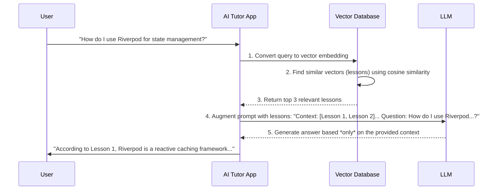

# Module 12: Semantic Search & Retrieval-Augmented Generation (RAG)

## 🎯 What is RAG?

**Retrieval-Augmented Generation (RAG)** is an architecture that allows a Large Language Model (LLM) to answer questions using specific, private, or real-time data that it wasn't trained on. In this project, we use RAG to make our AI Tutor an expert on **your specific course content**, preventing it from making up answers (hallucinating).

---

## 🏗️ How it Works: The "Search then Think" Loop

The core idea is simple: before the LLM answers a question, we first search our own knowledge base for relevant information and provide that information to the LLM as context.



---

## 🧩 Key Components

### 1. Vector Embeddings: The DNA of Meaning
An embedding is a list of numbers (a vector) that represents the semantic meaning of a piece of text. We use the Gemini Embedding API to convert our lesson content and the user's questions into these vectors.

- **"The sky is blue"** -> `[0.1, 0.8, 0.2, ...]`
- **"The ocean is blue"** -> `[0.12, 0.78, 0.25, ...]` (very similar vector)
- **"I like pizza"** -> `[0.9, 0.2, 0.8, ...]` (very different vector)

### 2. Semantic Search & Cosine Similarity
Instead of matching keywords, we compare the *meaning* of the question to the *meaning* of our documents. We do this by calculating the **cosine similarity** between the question's vector and each lesson's vector. This measures the angle between the two vectors; a smaller angle means they are more semantically similar.

### 3. The `KnowledgeRepository`: A Code Example
This class is responsible for finding the most relevant documents for a given query.

```dart
class KnowledgeRepository {
  final EmbeddingClient _embeddingClient;
  final List<Document> _documents; // Your lessons

  KnowledgeRepository(this._embeddingClient, this._documents);

  Future<List<Document>> findRelevantDocuments(String query, {int topK = 3}) async {
    // 1. Generate an embedding for the user's query
    final queryEmbedding = await _embeddingClient.generateEmbedding(query);

    // 2. Calculate the similarity between the query and each document
    final rankedDocuments = _documents.map((doc) {
      final similarity = cosineSimilarity(queryEmbedding, doc.embedding);
      return MapEntry(doc, similarity);
    }).toList();

    // 3. Sort by similarity and take the top K results
    rankedDocuments.sort((a, b) => b.value.compareTo(a.value));
    return rankedDocuments.take(topK).map((e) => e.key).toList();
  }

  double cosineSimilarity(List<double> v1, List<double> v2) {
    // ... implementation of cosine similarity formula ...
    return dotProduct / (normA * normB);
  }
}
```

### 4. Local vs. Cloud Vector Stores
- **Local:** For small datasets (like in our app), a simple list of documents in memory is fine.
- **Cloud (Vector DB):** For thousands or millions of documents, a dedicated vector database like **Pinecone**, **Weaviate**, or **Supabase (pgvector)** is essential. They are optimized for extremely fast similarity searches on massive datasets.

### 5. Hybrid Search
Semantic search is powerful, but sometimes users search for specific keywords or product IDs. **Hybrid search** combines the best of both worlds:
- **Keyword Search (like BM25):** Finds documents with the exact search terms.
- **Semantic Search:** Finds semantically related documents.
The results from both are then combined and re-ranked to provide the most relevant results.

## 🛡️ Why RAG is "God-Tier" Engineering

1.  **Reduces Hallucinations**: Forces the AI to base its answers on your provided data.
2.  **Enables Real-Time Knowledge**: You can add new documents to your vector database at any time, and the AI will have access to that information instantly without retraining.
3.  **Increases Privacy**: Your private documents are not sent to the AI provider for training. Only relevant snippets are sent in the prompt.
4.  **Cost-Effective**: Reduces the amount of data you need to send in each prompt, saving on token costs.
