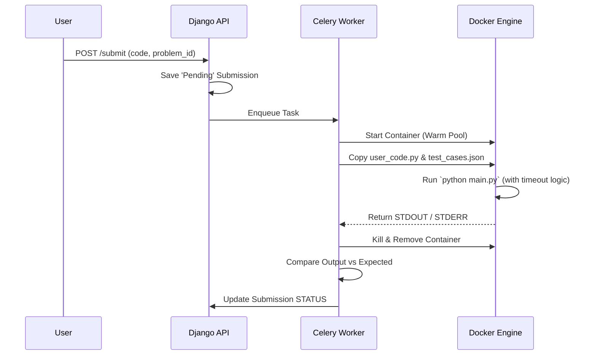

# 🧠 Deep Dive: Designing a Remote Code Execution (RCE) Engine

_The "LeetCode" Architecture_

## ❓ The Problem

You want to allow users to write Python/C++ code in their browser, send it to your server, and run it.
**Sound simple?** It is the most dangerous feature you can build.

### 💀 The Risks

1.  **Infinite Loops**: User writes `while True: pass`. Your CPU hits 100% forever. Server dies.
2.  **Fork Bombs**: User writes `while True: os.fork()`. Crushes OS process table.
3.  **File System Attacks**: `os.remove('/etc/passwd')`. Deletes your server files.
4.  **Network Attacks**: User code scans your internal network (AWS metadata service).

---

## 🛡️ The Architecture of Safety

To build this safely, we need **Isolation**. We treat user code like a virus. We run it in a "Digital Hazmat Suit".

### 1. Sandboxing (The Hazmat Suit)

We can't just run `eval(user_code)`. We use layers of isolation:

#### Level 1: The Docker Container

We spin up a NEW Docker container for _every single submission_.

- **Why?** If the user deletes files, they only delete files in a temporary container that vanishes in seconds.
- **Cost**: High latency (spinning up containers takes 1-2s).
- **Optimization**: **Warm Pool**. Keep 50 containers "paused" and ready to go.

#### Level 2: Resource Limits (cgroups)

We use Linux Control Groups (cgroups) to strangle the process.

- **CPU**: Max 0.5 vCPU.
- **RAM**: Max 128MB.
- **PID Limit**: Max 10 processes (prevents fork bombs).

#### Level 3: Network Gapping (namespaces)

The container has **NO** network interface. `eth0` is down.

- User code cannot call external APIs.
- User code cannot talk to your Database.

### 2. The Execution Flow



---

## 🧩 Our Implementation (The MVP)

For our **Learning Hub**, running a full Docker cluster is overkill for `localhost`. We will simulate this using a **Service Layer Architecture**.

### The `CodeExecutorService`

Instead of actual Docker (for now), we will use Python's built-in tools with strict safeguards, preparing for a future move to Docker.

#### 1. Input Validation

We scan the code string _before_ execution.

```python
FORBIDDEN_KEYWORDS = ['os.', 'sys.', 'subprocess', 'open(', '__import__', 'eval', 'exec']
if any(word in user_code for word in FORBIDDEN_KEYWORDS):
    return "SECURITY ERROR: Dangerous keywords detected."
```

_Note: This is "Security by Obscurity" and not production-safe, but okay for a learning MVP._

#### 2. Timeouts

We use `multiprocessing` with a `timeout`.

```python
p = multiprocessing.Process(target=run_user_code)
p.start()
p.join(timeout=1) # 1 second limit
if p.is_alive():
    p.terminate()
    return "Time Limit Exceeded"
```

---

## 🧪 Real World Engineering Lesson

**"Trade-offs define the Engineer."**

- **LeetCode** prioritizes _security_ and _correctness_. They accept the complexity of Docker/Kubernetes.
- **We (Learning Hub)** prioritize _portability_ and _simplicity_ (so you can run it on Windows without Docker).
- **The Trade-off**: We accept that our current MVP is _not_ fully secure against malicious attackers, but it is sufficient for a self-learning tool.

### Future Upgrade Path

When we go to production:

1.  Install **Judge0** (Open source CE API).
2.  Replace our local execution logic with a call to the Judge0 API.
3.  Architecture doesn't change, only the _Execution Implementation_ changes. **That is the power of Modular Design.**
