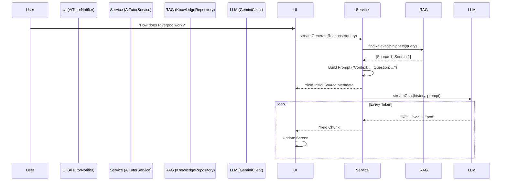

# 🎓 GOD-TIER LESSON 1: The Art of Streaming RAG

## 1. The Concept: Why Stream?

In AI applications, latency is the enemy. Waiting 3-5 seconds for a full "Thought" to generate feels like an eternity to a user.
**Streaming** solves this by delivering the response chunk-by-chunk (token-by-token).

- **Perceived Latency:** < 500ms (Excellent)
- **Actual Latency:** Same as before, but the user is occupied reading.

## 2. The Architecture: RAG Pipeline

We implemented a **Retrieval-Augmented Generation (RAG)** pipeline. Here is the data flow:



## 3. The Implementation (Dart God-Mode)

### Interface Design (`LLMClient`)

We enforced consistency by defining the contract first:

```dart
abstract class LLMClient {
  Future<String> chat(...); // Unary
  Stream<String> streamChat(...); // Streaming
}
```

### The Service Layer (`AiTutorService`)

We used Dart's `async*` generator to create a seamless stream that mixes Metadata and Text:

```dart
Stream<TutorResponse> streamGenerateResponse(...) async* {
  // 1. Yield Metadata immediately (Instant feedback)
  yield TutorResponse(sources: determinedSources, message: "");

  // 2. Stream Tokens
  await for (final chunk in _client.streamChat(...)) {
    yield TutorResponse(message: chunk, sources: sources);
  }
}
```

### The UI Layer (`AiTutorNotifier`)

We replaced the "Simulated Loop" with a real stream listener:

```dart
await for (final chunk in _service.streamGenerateResponse(...)) {
   buffer.write(chunk.message);
   state = state.copyWith(text: buffer.toString());
}
```

## 4. Key Takeaways

1.  **Don't Block UI:** Never `await` a long process if you can stream it.
2.  **Layers Matter:** The UI doesn't know _how_ the stream works (Gemini vs Mock). It just consumes `TutorResponse` objects.
3.  **Feedback:** Always provide immediate feedback (sources found) even if the text isn't ready.

---

_Generated by Antigravity Auto-Thinking Engine_
